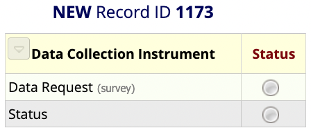
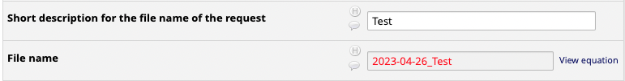
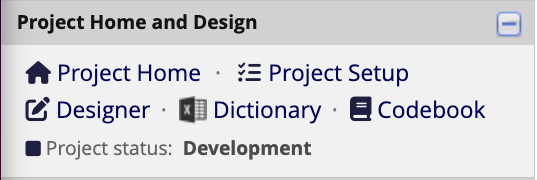

# Data Request SOP 

## Creating a New Data Request 

1. Navigate to the ‘Mesulam Center Data Requests’ database in REDCap.
2. Under the ‘Data Collection’ tab on the left panel, select [‘Add/Edit Records’](https://redcap.nubic.northwestern.edu/redcap/redcap_v13.1.25/DataEntry/record_home.php?pid=7662).
3. Click the large green ‘+ Add new record’ button. This will create a new Record ID and allow you to select the ‘Data Request’ and ‘Status’ Instruments. 
```{r, echo=FALSE, fig.cap="", out.width = '50%', out.extra='style="background-color: #41444B; padding:2px;"', fig.align = 'center'}

```

## Fill out the Data Request Form

1. Select the Data Request Instrument button under the Data Collection Instruments. 
2. Fill out the ‘Request Information’ and ‘Requestor Information’ Sections.
    a. Enter the Date of request, Requestor name, and Requestor email. This can be the person filling out the form or the person who requested the data. 
    b. Enter the names of anyone else involved with or knowledgeable of the request.
    c. Select the type of Data Request.
3. Fill out the ‘Request Data’ Section. 
    a. Write a brief description of the data request. This should be a few sentences about what is needed for the data request and, if known, why it is being requested.
    b. Enter a short description of the request. This should be a few words and is used to create the file name where all documents for this data request will be stored. 
```{r, echo=FALSE, fig.cap="", out.width = '100%', out.extra='style="background-color: #41444B; padding:2px;"', fig.align = 'center'}

```
        i. Create a new folder in the Data Requests Sharepoint. Copy and paste the calculated ‘File name’ to name the new folder. This is where all files for this data request will be stored. 
    c. Select the UDS version(s) needed. 
        i. For current REDCap data, select UDS3. 
        ii. For historical data in StudyTracker, select MDS/UDS1/UDS2.
    d. Select the location(s) of the raw data for the request.
4. Fill out the ‘Request Tagging’ Section. 
    a. Select an ‘Impact/Need’ score on the slider scale. 
    b. Select if there is any concern about the completion of the project.
    c. Select the ‘Scope’ of the project. 
    d. Select the approximate total time ‘Duration’ to finish the project. 
    e. The above fields will return a priority score, which can be used to prioritize all in-progress projects. 
    f. Select the reason(s) for the scope choice.
5. Fill out the ‘Storage Locations’ Section – this can be done immediately or when the data request is complete. 
    a. Paste the link to the Data Request folder. 
        i. In Sharepoint, left click on the folder of the data request. Select ‘Share’. A window will pop up with options to send the link to the folder.  
```{r, echo=FALSE, fig.cap="", out.width = '33%', out.extra='style="background-color: #41444B; padding:2px;"', fig.show='hold', fig.align = 'center'}
knitr::include_graphics(c("share_file.png","share_people_specify.png","share_existing_access.png"))
```
        ii. Select ‘People you specify can edit’ under the Copy link section. 
        iii. Select ‘People with existing access’. Click Apply. 
        iv.	Copy the link and paste into the corresponding box.  
    b. Paste the link to the Collaborators folder.
        i. Follow steps 8a-i. through 8a-iv for the Collaborator folder.
    c. Paste the link to the Collaborators data file.
        i. Follow steps 8a-i. through 8a-iv for the Collaborator file.
    d. Write up a brief description to document the data request OR Paste the link to the Documentation file in the Documentation box. 
        i. If Pasting a link, follow steps 8a-i. through 8a-iv.
6. Always mark the Form Status ‘Complete’. Save and Exit Form.

## Fill out the Status Instrument 
7. Select the Status Instrument button under the Data Collection Instruments. 
8. After creating a data request, select the appropriate status. 
9. Enter the Percent Complete.
    a. If not yet started, enter 0. 
    b. Update the Percent Complete as progress is made for the data request. 
10. The NetID will auto-populate for the person who is filling out the form. This can be changed manually as needed.
11.	Enter any notes about the status of the data request.
12.	Always mark the Form Status ‘Complete’. Save and Exit Form.


## Completing the Data Request
1. After the Data Request Forms have been completed on REDCap, pull the required data. 
2. Save all files in the corresponding Data Request folder. 
3. If the Data Request is for a Collaborative Application, create the Collaborator folder within the Data Request folder. Store all files that will be shared with the Collaborator within the Collaborator folder. They will only have access to this specific folder, not the entire Data Request folder. 
4. Create a Data Dictionary – this should be stored in the Collaborator folder if there is one; otherwise, it can be stored in the general folder for this Data Request. See Step 3 for steps to create a data dictionary. 


## Creating the Data Dictionary
Note: The Data Dictionary will store all variables for the specific Data Request with information about each. This step should be completed for both internal data requests and collaborative application data requests to inform the receiver of the data on each of the variables. 

1. For each database used for the Data Request, navigate to the corresponding ‘Dictionary’ page which can be found on the left panel of REDCap.
```{r, echo=FALSE, fig.cap="", out.width = '60%', out.extra='style="background-color: #41444B; padding:2px;"', fig.align = 'center'}

```
2. Once on the Data Dictionary page, select ‘Download the current Data Dictionary’. A .csv file of all variables in the database will be downloaded. Open the downloaded file.  
3. Filter the Data Dictionary and delete any unneeded variables for the data request. 
4. Save the final Data Dictionary, which now consists of only the variables that were required for the Data Request, in the Data Request folder or the Collaborator folder (if for a Collaborative Application). 
5. If more than one database was used for the Data Request, repeat steps 1 – 4 for each database. Compile all variables from the multiple databases into a single .csv or .xlsx file. 


## Documenting the Data Request
The purpose of the data documentation for a Data Request is to explain everything that was done. This should include:

* How the data was pulled – which databases were used; specify if the data was pulled via a REDCap report, through the API, or through some other method.
* What data was pulled – which variables were pulled from each database.
* What was done to the data after it was pulled – additional filtering or sorting, adding comments/variables, calculations, etc.

A. If the documentation only consists of a few sentences or a few short paragraphs, it can be entered directly into the Data Request Form Documentation textbox.
B. If the documentation requires a longer explanation, create a word document and paste the link to the documentation into the Data Request Form Documentation textbox. 


