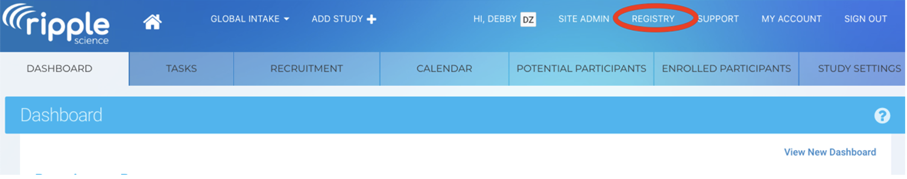
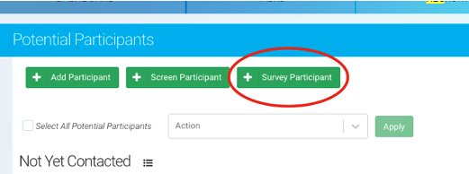

# Ripple SOP 

## Ripple General SOP
1. Ripple Science
    a. Ripple Science is a web-based software for CROs, Principal Investigators, and Project Coordinators that aids in participant recruitment and management.
    b. Ripple Science may be accessed by navigating to [https://mesulamcenter.ripplescience.com](https://mesulamcenter.ripplescience.com). For access to Ripple, contact the data manager or the project manager.
2. When logging into ripple, you see a navigation menu running across the top. 

## Registry 
```{r, echo=FALSE, fig.cap="", out.width = '80%', out.extra='style="background-color: #41444B; padding:2px;"', fig.align = 'center'}

```
<br/>

1. The registry contains all participants that have ever expressed interest in the Mesulam Center, both participants enrolled in research, caregivers enrolled in support groups, potential participants that were screened and ineligible, etc. 
2. The registry is sorted by last name. The name of the participant/potential participant is in the first column, the list of studies that they have been added to is in the second, followed by sex and age and if they have ever been contact/when was the last time they were contacted. 
```{r, echo=FALSE, fig.cap="", out.width = '100%', out.extra='style="background-color: #41444B; padding:2px;"', fig.align = 'center'}
knitr::include_graphics("ripple_all_participants.png")
```
5. Search for a participant:
    a. To search for a specific participant, search either the last name, first name or global ID, the 15-17 alphanumeric unique ripple identifier for each person in the Ripple database.
<br/>
```{r, echo=FALSE, fig.cap="", out.width = '50%', out.extra='style="background-color: #41444B; padding:2px;"', fig.align = 'center'}
knitr::include_graphics("ripple_search.png")
```
<br/>
    b. To search for a group of potential participants that all meet the same criteria, you can filter the registry. 
        i. The below example search is for the number of people that were added to the Ripple registry after 1/1/23 until the date the report was filtered (1/25/23) and are above 80 years old and have not already been added to the superaging study. This resulted in 14 participants. For these participants, you can see if they have been contacted, what age they are, and what other studies they came in from. 
        ii.	For more information click the arrow in blue to the right of each participant, to go to their contact card with all of the information about studies they have been added to, how much they have been contact, contact information, and screening information needed to determine eligibility. See more about the participant contact card below. 
        iii. If the person has been added to the global intake study, they were recruited from our online survey, if they are added to the URG Outreach study, they were recruited at a community event, and if they are not added to either, they were manually entered into the database. 
```{r, echo=FALSE, fig.cap="", out.width = '100%', out.extra='style="background-color: #41444B; padding:2px;"', fig.align = 'center'}
knitr::include_graphics("ripple_registry_filters.png")
```
    c. Adding participants to a study:
        i. To add a participant to a study, click the check box next to their name, then a dropdown will appear at the top. Select the study and click apply. Multiple participants can be added to a study at one by clicking the check box next to each participant. 
<br/>
```{r, echo=FALSE, fig.cap="", out.width = '50%', out.extra='style="background-color: #41444B; padding:2px;"', fig.align = 'center'}
knitr::include_graphics("ripple_add_to_study.png")
```

## Studies 
1. Each study recruiting participants at the Mesulam Center has a separate Ripple page. To navigate to a study, go to “select study” in the upper left hand of the page. 
2. A list of the studies that you have access to will appear. 
```{r, echo=FALSE, fig.cap="", out.width = '70%', out.extra='style="background-color: #41444B; padding:2px;"', fig.align = 'center'}
knitr::include_graphics("ripple_studies.png")
```
3. To be added to a ripple study, contact the manager of that project and the data manager. 
4. Study Coordinators and Research Assistants will only have access to those studies that they are IRB approved to work on. 
5. Only participants that have been added to each study will be visible on each study page. 
6. When you go to a study, you will see different tabs across the top, dashboard, tasks, recruitment, calendar, potential participants, and enrolled participants. 

### Dashboard 
```{r, echo=FALSE, fig.cap="", out.width = '100%', out.extra='style="background-color: #41444B; padding:2px;"', fig.align = 'center'}

```

1. The first of several tabs, and the landing page upon login, is the Dashboard. The Dashboard provides an overview of the study’s recruitment progress as well as analytic insights for recruitment. Some studies at the Musallam center do not utilize this tab. 

### Tasks
1. The second tab is the Tasks page where scheduling and recruitment tasks can be assigned to different team members. Only the Clinical Core and PPA studies use the Tasks Tab.
2. Tasks can be anything that has been assigned to a study team member, from scheduling a participant to completing a visit, to a social work call. 
3. The tasks tab will have all of the tasks currently assigned for the whole team. 
4. To see your individual tasks, go out of the study, to your ripple home page:
```{r, echo=FALSE, fig.cap="", out.width = '50%', out.extra='style="background-color: #41444B; padding:2px;"', fig.align = 'center'}
knitr::include_graphics("ripple_home.png")
```
    a. Here you can view all of the tasks assigned to you. You can also access the report builder which will be covered later. 

### Recruitment
1. The third tab is the Recruitment page. This page is where sources and strategies may be updated for recruitment tracking purposes. This page is specific to one study and recruitment sources need to be tracked center wide, so study specific recruitment sources are not used for any Mesulam Center studies. 

### Calendar
1. The third tab is the Calendar page. The calendar page shows all upcoming visits.
    a. Google calendar to Ripple Integration:
        i. Currently the PPA, Clinical Core, and SuperAging are automatically linking visits from the google calendar. 
        ii. Adding a visit to the google calendar to automatically add to Ripple:
            1. Title in Google Calendar: #Ripple Custom ID [Event Abbreviated Name] 
```{r, echo=FALSE, fig.cap="", out.width = '50%', out.extra='style="background-color: #41444B; padding:2px;"', fig.align = 'center'}
knitr::include_graphics("ripple_calendar_title.png")
```
            2. When the Google Calendar title is in this format, the visit is logged as scheduled in Ripple. 
            <br/>
```{r, echo=FALSE, fig.cap="", out.width = '50%', out.extra='style="background-color: #41444B; padding:2px;"', fig.align = 'center'}
knitr::include_graphics("ripple_calendar_log.png")
```
            3. To find the custom ID, go to the participant contact card in the potential participants or enrolled participants tab. If the participant does not have a custom ID, one must be created before scheduling on the google calendar. If the custom ID is blank, the visit will not connect from the google calendar. 
            4. Once the there is a result for the Event, add the result to the end of the title (Complete, Rescheduled, Canceled, No Show).
            
### Potential Participants
1. The Potential Participants tab is where any participant added to the ripple study but not enrolled will be organized and managed.
2. For the 3 registry projects (Global intake, URG Outreach, and Miller Registry), all participants will be held “potential participants”, because these three projects do not enroll, but facilitate enrollment for other studies. 
3. Participants will be organized into one of several statuses that are defined for each study. 
4. Common statuses are: Not Yet Contacted, Screening In-progress, Eligible, Ineligible, Scheduled

### Enrolled Participants
1. Once the participant is scheduled and comes in for the visit, they are moved to the enrolled tab. 
2. The Enrolled Participants tab is where enrolled participants will be organized and managed.
3. Participants will be organized into one of several statuses that are defined for each study.
4. Common Status for Enrolled are: Active, Inactive/No Longer Pursuing, Deceased. 

### Study Settings 
1. The sixth and final tab is the Study Settings page. This is where things such as display, statuses, or other features may be edited. Study Coordinators and Research assistants should not make any changes or edits to the Study Settings. Requests for changes should be shared with the study manager.

## Adding Participants
1. Before adding a new participant, search the registry first to determine if an individual has already been added to Ripple. The registry can be accessed within the header.
```{r, echo=FALSE, fig.cap="", out.width = '100%', out.extra='style="background-color: #41444B; padding:2px;"', fig.align = 'center'}

```
    a. Once an individual is identified within the registry, they can be added to a study by selecting the checkmark next to their name and utilizing the dropdown menu at the top of the page.
```{r, echo=FALSE, fig.cap="", out.width = '100%', out.extra='style="background-color: #41444B; padding:2px;"', fig.align = 'center'}
knitr::include_graphics("ripple_add_participant.png")
```
2. If an individual cannot be found within the registry, they will need to be directly added to a study. 
    a. This can be done by navigating OUT of the registry and into a specific study (through the study dropdown in the upper left corner of Ripple). Go to the Potential Participants tab select “Survey Participant”. Do not select “Add Participant” because adding a participant through a survey allows for entry of more participant information. 
```{r, echo=FALSE, fig.cap="", out.width = '100%', out.extra='style="background-color: #41444B; padding:2px;"', fig.align = 'center'}
knitr::include_graphics("ripple_survey_participant.png")
```
    b. A dropdown will appear with the list of surveys available. Choose the “Add/View Participant” Survey, then click “open”
    c. A pop-up window will then appear. Enter the first name, last name, preferred name (if applicable), and the status that they will enter the study as.
    d. First and Last Name of the participant are the only fields that are required. If you do not know the name of the participant, but you know the first and last name of someone connected to them, add that person’s first and last name with an asterisk behind both the first and last name. Once you get more information, you can change the names in the contact card. 
```{r, echo=FALSE, fig.cap="", out.width = '100%', out.extra='style="background-color: #41444B; padding:2px;"', fig.align = 'center'}
knitr::include_graphics("ripple_participant_info.png")
```
    e. Then you will be asked what other information you have for this participant. Select all that apply. 
```{r, echo=FALSE, fig.cap="", out.width = '100%', out.extra='style="background-color: #41444B; padding:2px;"', fig.align = 'center'}
knitr::include_graphics("ripple_other_info.png")
```
    f. For each selected, questions will appear to collect the information for the participant. Be sure to enter as much information for the participant as possible. 
    g. The last question is whether we can add them to our mailing list. 
    h. For the URG Outreach study, there are two more questions (see below) to indicate which studies this participant seems best suited for and what status the participant belongs in.
    <br/>
```{r, echo=FALSE, fig.cap="", out.width = '70%', out.extra='style="background-color: #41444B; padding:2px;"', fig.align = 'center'}
knitr::include_graphics("ripple_urg_referral.png")
```
        i. For the URG Status, all new participants should be “Contact Not Initiated”.
    i. Once this survey is complete, the information saved in the survey can be viewed in the participant contact card see below for more information. 
    
## Participant Contact Card
3. It is imperative that the participant's contact information be maintained in an accurate manner to ensure records are up to date.
4. To access a participant’s contact card, click the blue arrow next to their entry (in either potential participants or enrolled participants in any study or in the registry). Ideally, the contact card should be as complete as possible. It should be updated as soon as possible when any changes are available.
5. There are 9 sections to the contact card:

### General
```{r, echo=FALSE, fig.cap="", out.width = '80%', out.extra='style="background-color: #41444B; padding:2px;"', fig.align = 'center'}
knitr::include_graphics("ripple_general_contact.png")
```

1. This section has the participant’s first and last name at the top. You can change the first and last name by clicking on the name. 2. Custom ID and family ID
    a. The custom ID is used at the specific study ID, and the family ID is used to connect family members that each have their own ripple records. Some studies use the custom ID field, but the family ID field is not yet used. 
3. Global ID
    a. The global ID is assigned to all individuals at the time that they are added to Ripple. It is a 15-17 digit alpha-numeric unique identifier. The global ID is used across all Mesulam Center studies and follows participants from Ripple to other databases like, REDCap to link participants in each. 
4. Contact For Future Studies?
    a. Consent forms should include an optional element allowing researchers to contact for future studies. This box should only be checked if participants have consented or otherwise indicated that they would like to be contacted for future research studies.
5. Signed Consent Form
    a. Once an individual signs a consent form as a participant, this box should be checked, and the date of consent should be added for each study.
    
### Comments/Email/Contact/Consent/Forms
1. Comments
    a. Comments are used as general notes about a participant. 
    b. Only pertinent information should be added as comments.
    c. Comments should not be used to log contact attempts (see below). If a comment needs to be logged as a result of a contact attempt, log the contact attempt, then log the comment. 
    d. All comments are automatically logged as global, meaning they are visible to all studies. Most comments should be global. If a comment needs to be available to only the current study, unselect the “global” box. 
    e. Information that is reflected in custom variables should not be listed as comments or made global to avoid redundancy. See section below on custom variables.
2. Email
    a. All emails sent through Ripple will be seen here. See below for how to send emails or bulk emails through Ripple. 
    b. All emails should also be logged as a contact attempt, by checking the box for “log as contact attempt” when writing the email. 
3. Contact Attempts
    a. The contact tab is where all contact attempts made by any study team member to a research participant or study partner are logged. Any communication from a research participant to a study or study team member also needs to be logged.
    b. It is critical to capture how often we are reaching out to participants and how often they are responding or reaching out to us so that we can better plan for scheduling and better understand the science of recruitment. 
    c. All contact attempts should be documented within Ripple and marked as global.
    d. One contact attempt needs to be logged for any phone call, email or text message sent. And if sending an email or text, a separate contact attempt needs to be logged for each. Again, it is important to capture not just how often we reach out, but also how often the participant responds. 
    e. Ongoing email or text message conversations about a singular topic need only be documented as two contacts, one contact logged documenting that we reached out and one contact logged that the participant responded. 
    f. All phone calls should be documented individually along with their outcomes.
```{r, echo=FALSE, fig.cap="", out.width = '100%', out.extra='style="background-color: #41444B; padding:2px;"', fig.align = 'center'}
knitr::include_graphics("ripple_contact.png")
```
    g. Below is an example contact attempt log: 
```{r, echo=FALSE, fig.cap="", out.width = '70%', out.extra='style="background-color: #41444B; padding:2px;"', fig.align = 'center'}
knitr::include_graphics("ripple_contact_attempt.png")
```
    h. Be sure to fill out all applicable fields
    i. Regarding: Only Enter the Below Categories to better track why we are contacting participants:
        i. Screening 
            * All contact before enrollment. 
        ii.	Scheduling
        iii. ADRC Informant Only Call
        iv.	Brain Donation
        v. Information sent during/after visit
        vi.	Check-in/Psychosocial Pathway
        vii. Adverse Events
        viii.	Study Retention Events 
        ix.	Media Opportunities
        x. Moving Enrollment Groups
            * Participant moving from one group to another (in person to victual participation)
        xi.	MRI- Imaging Core
            * This category is reserved for the imaging team reaching out to participant. All MRI scheduling contact by the study team is logged as “scheduling”.
    j. Outcome: Contact attempt outcomes should be documented in each contact attempt to accurately capture recruitment efforts. The following outcomes will be made standard in each Ripple study: Spoke to Participant, Spoke to Study Partner, Left Voicemail, Other. Requests for additions or changes to contact outcomes should be given to the Manager.
    k. Always write descriptive notes about each contact attempt. 
    l. Comments: Be sure to log through notes about each contact. 
4. Consent Log 
    a. The consent log is not used for any studies. In the general section, check that consent has been signed and log the date. 
5. Forms
    a. PDFs of all completed surveys and screeners can be downloaded from here. 

### Events
1. This is where different visits are listed for each study. Completed and upcoming visits can be viewed here. 

### Tasks
1. All tasks associated with this participant will be shown here. 

### Contact Information
1. The participant and each study partner should have contact information listed within the participant’s contact card.
2. When new information is obtained, the contact card should be updated as soon as possible. When updating the participant’s contact information archive the old information and add the new information so the old contact information is preserved. 

### Demographics
1. Lists the participant’s age, sex, race, ethnicity and birthday.
2. Demographics should not be edited after initial completion except to correct an error.

### Custom Variables
1. Below the demographics are Mesulam Center wide or Specific study defined custom variables, data that is important to recruitment that is not captured in Ripple’s standard fields and features above. 
2. [Here](https://nuwildcat.sharepoint.com/:x:/s/FSM-MesulamCenterDataMgmt/EWmgquH9jwRAoISkUpz0occBBjIdNpnGjDWUw1J8TLMNsA?e=jmQDO2) is a link to all of the custom variables that are used in the Mesulam Center Ripple accompanied by a description of each variable and which study’s ripple page each variable is available in. 
3. All information completed on Ripple surveys will automatically fill in these fields if the survey id set up properly. 

### Recruitment
1. Ripple provides 3 recruitment variables that are specific to specific to each study and cannot be universal to all studies. Because the Mesulam center needs to track how participants are recruited outside of each study, these fields cannot be used. 

### Family
1. All family members that the participant is connected to through the family ID are listed here. 

## First Pass Consideration
1. Each week, a new participants added to Ripple email is sent out. For each participant on this list, update the First Pass Consideration Result and (if any) Reasons not pursuing for each study. One member from each study should complete the First Pass Consideration.
2. Navigate to the Registry. 
```{r, echo=FALSE, fig.cap="", out.width = '100%', out.extra='style="background-color: #41444B; padding:2px;"', fig.align = 'center'}

```
3. On the Registry page, search for each participant using the Ripple Global ID. 
```{r, echo=FALSE, fig.cap="", out.width = '50%', out.extra='style="background-color: #41444B; padding:2px;"', fig.align = 'center'}
knitr::include_graphics("ripple_search.png")
```
4. Select the participant and review their record. 
5. If they meet any First Pass criteria, find your study-specific First Pass variables under the ‘Custom Variables’ section. 
6. Select the appropriate ‘First Pass Consideration Result’. 
7. If the First Pass Result is ‘Not Pursuing’, find the variable ‘Reasons not pursuing’ and select the correct option from the dropdown list.
8. If the First Pass Result is ‘Potential participant’, immediately add the participant to the appropriate study. 
    a. View the ‘Adding Participants’ section in this SOP for more information. 

## First Contact Procedure
1. Upon first contacting a participant for screening, go to the potential participant tab for the list of potentially eligible participants. As mentioned in the potential participant section of this SOP, the participants in this tab will be separated into different screening statuses that are different for each study. 
```{r, echo=FALSE, fig.cap="", out.width = '100%', out.extra='style="background-color: #41444B; padding:2px;"', fig.align = 'center'}
knitr::include_graphics("ripple_pot_part_tab.png")
```
2. Find a participant that needs to be contacted and click the blue arrow to the right of their name in the potential participants list. 
```{r, echo=FALSE, fig.cap="", out.width = '100%', out.extra='style="background-color: #41444B; padding:2px;"', fig.align = 'center'}
knitr::include_graphics("ripple_select_participant.png")
```
3. At the top of the participant’s contact card, select “Survey Participant”.
```{r, echo=FALSE, fig.cap="", out.width = '50%', out.extra='style="background-color: #41444B; padding:2px;"', fig.align = 'center'}

```
4. Click into the “Add/View Participant Survey”.
```{r, echo=FALSE, fig.cap="", out.width = '50%', out.extra='style="background-color: #41444B; padding:2px;"', fig.align = 'center'}
knitr::include_graphics("ripple_addview_participant.png")
```
5. This form gives an overview of the information we have on this participant. Right after the name and status is a question asking to confirm the recruitment information. All participants should be asked to confirm how they heard about us upon the first contact. 
<br/>
```{r, echo=FALSE, fig.cap="", out.width = '70%', out.extra='style="background-color: #41444B; padding:2px;"', fig.align = 'center'}
knitr::include_graphics("ripple_rec_source_confirm.png")
```
6. Check the current recruitment method that we have on file but scrolling down in the form. Confirm that the recruitment method that we have on file is the correct recruitment methods. 
<br/>
```{r, echo=FALSE, fig.cap="", out.width = '70%', out.extra='style="background-color: #41444B; padding:2px;"', fig.align = 'center'}
knitr::include_graphics("ripple_recruitment_source.png")
```
<br/>
7. Mark whether the recruitment method has been confirmed and add notes about the confirmation including your NetID and the date of the confirmation.
```{r, echo=FALSE, fig.cap="", out.width = '70%', out.extra='style="background-color: #41444B; padding:2px;"', fig.align = 'center'}
knitr::include_graphics("ripple_rec_source_notes.png")
```
8. Review the rest of the form and obtain any information on the form that may still be blank. 
9. Log the contact in the Contact Log. 
10. Move them into another status if appropriate. Refer to study specific recruitment SOPs. 

## Emails/Bulk Emails
1. Navigate to the Potential Participants or Enrolled Participants tab.
2. Select the Participants you would like to receive the email communication.
    a. <b><i>Note: ‘Send Bulk Email’ option will not appear if only 1 participant is selected.</b><i/>
3. Select “Send Bulk Email” from the drop-down menu. Click apply to open the Select Bulk Email Template window. 
```{r, echo=FALSE, fig.cap="", out.width = '100%', out.extra='style="background-color: #41444B; padding:2px;"', fig.align = 'center'}
knitr::include_graphics("ripple_select_bulk_email.png")
```
4. Select your desired email template from the dropdown list. 
```{r, echo=FALSE, fig.cap="", out.width = '70%', out.extra='style="background-color: #41444B; padding:2px;"', fig.align = 'center'}
knitr::include_graphics("ripple_bulk_email_template.png")
```
5. Review the email and <b><i>update the event name and event date</b><i/> fields.
6. <b>Select Contact and Global to mark update in the contact log.</b> 
```{r, echo=FALSE, fig.cap="", out.width = '100%', out.extra='style="background-color: #41444B; padding:2px;"', fig.align = 'center'}
knitr::include_graphics("ripple_bulk_email.png")
```
7. Click the “Send Emails” button to send the email to the selected participants. 

## Looking Up a Participant Through URG Outreach
1. Go to the “URG Outreach” study and the “Potential Participants” tab
2. The participants in the potential participant’s tab are sorted into two statuses, “Contact not initiated”, 
3. “Contact in progress, not enough information to add to a study”, and “Contact Initiated”
    a. All participants start as “Contact not Initiated” meaning no one has looked at the participant to determine if they should be contacted for participation. 
4. To search for participants that have not been contacted or added to a study:
    a. Review the participants in the “Contact not initiated” status. 
5. To search for all participants that the community engagement team thinks are appropriate for your study, click “filter dashboard” and type in the name of your study.
```{r, echo=FALSE, fig.cap="", out.width = '100%', out.extra='style="background-color: #41444B; padding:2px;"', fig.align = 'center'}
knitr::include_graphics("ripple_urg_filter.png")
```
6. For each participant that is potentially eligible, go into their contact card
    a. Go to the notes section to see any notes from the community engagement team
    b. Click “Survey This Participant” at the top of the card to see the demographic information gathered at the event. 
7. For participants that may be eligible and can be added to a study:
    a. Change their status from “Contact Not Initiated” to “Contact Initiated”
        i. Click the check box to the left of the participant Name
        ii. At the top of the category, in the “Action” drop down box, select “Potential Initiating Contact” to indicate that someone is taking ownership of contacting that participant and that person is responsible for adding the participant to the appropriate study. 
```{r, echo=FALSE, fig.cap="", out.width = '100%', out.extra='style="background-color: #41444B; padding:2px;"', fig.align = 'center'}
knitr::include_graphics("ripple_urg_action.png")
```
    b. Add participant to your study to continue recruitment. 
        i. Go back to the registry, search the participant’s name and check the box next to their name to add them to the study. 
```{r, echo=FALSE, fig.cap="", out.width = '100%', out.extra='style="background-color: #41444B; padding:2px;"', fig.align = 'center'}
knitr::include_graphics("ripple_add_participant.png")
```
8. For participants that may be eligible and can’t yet be added to a study:
    a. Change their status from “Contact Not Initiated” to “Contact in progress, not enough information to add to a study”
        i. Click the check box to the left of the participant Name
        ii. At the top of the category, in the “Action” drop down box, select “Potential-Contact in progress, not enough information to add to a study” to indicate that someone is taking ownership of contacting that participant and that person is responsible for adding the participant to the appropriate study. 
```{r, echo=FALSE, fig.cap="", out.width = '100%', out.extra='style="background-color: #41444B; padding:2px;"', fig.align = 'center'}
knitr::include_graphics("ripple_urg_filter.png")
```
    b. Once there is sufficient information to add them to a study:
        i. Change their status from “Contact Not Initiated” to “Contact in progress, not enough information to add to a study”
            1. Click the check box to the left of the participant Name
            2. At the top of the category, in the “Action” drop down box, select “Potential-Contact Initiating” 
    c. Add participant to your study to continue recruitment. 
        i. Go back to the registry, search the participant’s name and check the box next to their name to add them to the study. 
```{r, echo=FALSE, fig.cap="", out.width = '100%', out.extra='style="background-color: #41444B; padding:2px;"', fig.align = 'center'}
knitr::include_graphics("ripple_add_participant.png")
```


