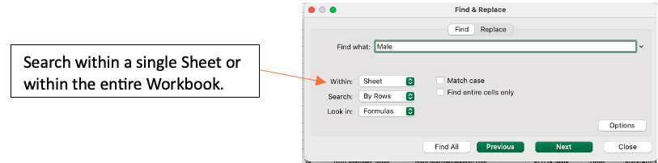
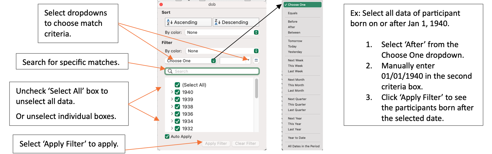
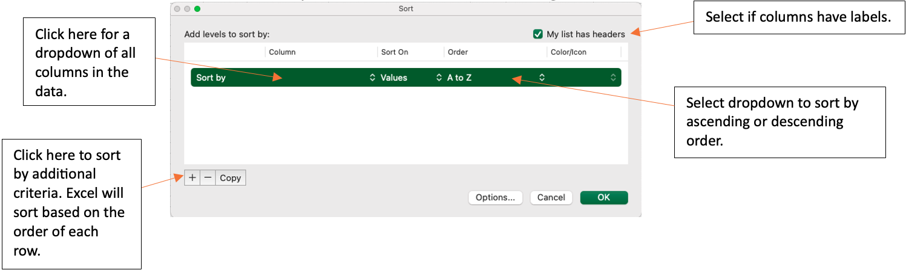
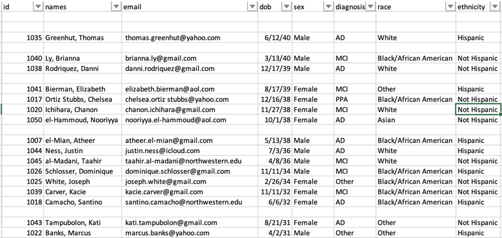

# Excel Features SOP 

This document functions as an instruction manual for Excel features commonly 
used after a REDCap Report is downloaded. All examples were created using the 
az_demo and az_test datasets from the Candidate Data Challenge, which contain 
computer-generated sample data. 

<b>Note:</b> <i>An important step to conserve the order of the original data is to add an 
index column. Left click the first column. Select ‘Insert’ from the dropdown. 
Title the new column ‘Index’. Enter a 1 in the first row with data, a 2 to the 
second row, and a 3 to the third row. Select the cells with the 1, 2, and 3 
indexes. Double-click on the small box on the lower right-hand side of the 
selected cells, which will auto-populate index values for all rows that contain 
data.</i>


## Find
1. Highlight the data you wish to search. Use the shortcut ‘Ctrl + F’ on a 
Windows or ‘Cmd + F’ on a Mac OR select the magnifying glass icon 
```{r, echo=FALSE, fig.cap="", out.width = '7%', out.extra='style="background-color: #41444B; padding:2px;"', fig.align = 'center'}

```
in the navigation pane. 
2. Enter the search keywords into the search bar and press enter to view. 
3. Continuing to press enter will cycle through all locations of the search keyword in the spreadsheet.
    Ex:
```{r, echo=FALSE, fig.cap="", out.width = '40%', out.extra='style="background-color: #41444B; padding:2px;"', fig.align = 'center'}
knitr::include_graphics("search_bar_excel.png")
```
4. For a more advanced search, use the ‘Advanced Search’ window. 
```{r, echo=FALSE, fig.cap="", out.width = '105%', out.extra='style="background-color: #41444B; padding:2px;"', fig.align = 'center'}

```


## Find & Replace
1. Highlight the data you wish to search and replace. This can include a single 
or multiple columns, or the entire spreadsheet. 
2. Use the shortcut ‘Ctrl + F’ on a 
Windows or ‘Cmd + F’ on a Mac OR select the magnifying glass icon 
```{r, echo=FALSE, fig.cap="", out.width = '7%', out.extra='style="background-color: #41444B; padding:2px;"', fig.align = 'center'}

```
in the navigation pane and select 'Replace...' from the dropdown. 
```{r, echo=FALSE, fig.cap="", out.width = '15%', out.extra='style="background-color: #41444B; padding:2px;"', fig.show='hold', fig.align = 'center'}
knitr::include_graphics("replace_button_excel.png")
```

3. Enter the search keywords into the ‘Find what’ search bar. 
4. Enter the replacement into the ‘Replace with’ search bar. 
    Ex: Replace a PTID with leading zeros. 
```{r, echo=FALSE, fig.cap="", out.width = '90%', out.extra='style="background-color: #41444B; padding:2px;"', fig.show='hold', fig.align = 'center'}
knitr::include_graphics("find_and_replace_excel.png")
```
5. Click ‘Replace’ for a single cell replacement or ‘Replace All’ to replace all selected data. 


## Filter Data
<i>Filters can be used to obtain desired data or remove unwanted data. To remove 
unwanted data from a spreadsheet, filter the data to obtain what is NOT wanted, 
then delete those rows. When the ‘Clear’ filter is applied, the undesired rows 
will be removed from the spreadsheet. A filter will not remove the rows from the 
spreadsheet until the user manually deletes the rows.</i>

1. To Sort or Filter data, begin by selecting the columns or rows you wish to 
filter. To add filters to all columns, click the downward triangle icon 
```{r, echo=FALSE, fig.cap="", out.width = '5%', out.extra='style="background-color: #FFFFFF; padding:2px;"', fig.align = 'center'}
knitr::include_graphics("select_all_excel.png")
```
in the upper lefthand corner of the spreadsheet. This selects all data in the 
spreadsheet. 
2. Navigate to the Editing dropdown on the Home tab in Excel. 
```{r, echo=FALSE, fig.cap="", out.width = '100%', out.extra='style="background-color: #41444B; padding:2px;"', fig.show='hold', fig.align = 'center'}
knitr::include_graphics("sort_and_filter_tab_excel.png")
```
3. Click ‘Sort & Filter’ for a dropdown and select ‘Filter’. The columns that 
were selected will now have a dropdown arrow. 

```{r, echo=FALSE, fig.cap="", out.width = '50%', out.extra='style="background-color: #41444B; padding:2px;"', fig.show='hold', fig.align = 'center'}
knitr::include_graphics("filter_button_excel.png")
```

4. Select the arrow next to the column you would like to use as a filter. A box 
will pop up for the filter selection criteria.
```{r, echo=FALSE, fig.cap="", out.width = '100%', out.extra='style="background-color: #41444B; padding:2px;"', fig.show='hold', fig.align = 'center'}

```

5. Select all necessary criteria and ‘Apply Filter’.
    a. <b>Note:</b> if a filter is being used to view and delete unwanted rows, after 
    applying the filter only the unwanted rows will be left. Select the rows to 
    be deleted and delete as normal. When the filter is cleared, only the desired 
    rows will be left in the spreadsheet. 
6. To clear a filter and view all rows of data, repeat steps 2 and 3 but select 
the ‘Clear’ option instead. All data that was not manually deleted will remain. 


## Sort Data
1.	To Sort or Filter data, begin by selecting the columns or rows you wish to 
filter. To add filters to all columns, click the downward triangle icon 
```{r, echo=FALSE, fig.cap="", out.width = '5%', out.extra='style="background-color: #FFFFFF; padding:2px;"', fig.align = 'center'}
knitr::include_graphics("select_all_excel.png")
```
in the upper lefthand corner of the spreadsheet. This selects all data in the spreadsheet. 
2. Navigate to the Editing dropdown on the Home tab in Excel. 
```{r, echo=FALSE, fig.cap="", out.width = '100%', out.extra='style="background-color: #41444B; padding:2px;"', fig.show='hold', fig.align = 'center'}
knitr::include_graphics("sort_options_excel.png")
```
3.	Click ‘Sort & Filter’ for a dropdown and select one of the three sort options:
    a. ‘Sort A to Z’ sorts alphabetically or numerically in ascending order. 
    b. ‘Sort Z to A’ sorts alphabetically or numerically in descending order. 
    c. ‘Custom Sort…’ opens a window for further sorting criteria.
```{r, echo=FALSE, fig.cap="", out.width = '100%', out.extra='style="background-color: #41444B; padding:2px;"', fig.show='hold', fig.align = 'center'}

```

Ex: Sort all data first by date of birth, then by race. Select the column ‘dob’ 
and order ‘Oldest to Newest’. Then select the ‘+’ to add another sort criteria. 
Select the column ‘race’ and order ‘A to Z’. 

```{r, echo=FALSE, fig.cap="", out.width = '70%', out.extra='style="background-color: #41444B; padding:2px;"', fig.show='hold', fig.align = 'center'}
knitr::include_graphics("sort_order_excel.png")
```

4. Enter all sorting criteria, then select ‘OK’. The selected data will now be sorted using your desired order. 
5. To revert to original order, sort by the index column in ascending order.


## Fill Empty Data
<i>The Fill function allows the user to specify criteria to fill in any cells 
with missing data. This is a useful tool when certain information is only in one 
row of the data, but needs to be entered in all rows with the same Global ID, 
PTID, name, etc. </i>

1. Starting data will look something like below: data for certain columns will 
be missing for specific rows. For example, stub information might only appear 
for stub events and will not be in the visit rows of data. This information 
will be filled using the fill function. 
2. Select the column you need to fill. Press ‘Ctrl + G’ for the ‘Go To’ pop-up 
window in Excel. Select ‘Special…’. A new pop-up window will appear. Select 
‘Blanks’ and press OK. All empty cells will be highlighted.
```{r, echo=FALSE, fig.cap="", out.width = '100%', out.extra='style="background-color: #41444B; padding:2px;"', fig.show='hold', fig.align = 'center'}
knitr::include_graphics("select_empty_cells_excel.png")
```
3. In the formula bar, enter the formula that matches the necessary criteria to 
fill the cell. 
    a. In this example, the formula is saying “If the id in 
    <span style="color: #0070C0">cell 1-4 (1003)</span> is equal to the id in 
    <span style="color: #FF0000">cell 1-5 (1003)</span>, then the current cell 
    equals the sex in <span style="color: #7030A0">cell 2-4 (Male)</span>. Else,
    leave the current cell blank (the id in cell 1-4 does not equal the id in cell 1-5).”
4. Press ‘Ctrl + Enter’ to carry the formula into each empty cell. The Excel 
formula will automatically move to the next cells down.
```{r, echo=FALSE, fig.cap="", out.width = '100%', out.extra='style="background-color: #41444B; padding:2px;"', fig.show='hold', fig.align = 'center'}
knitr::include_graphics("fill_empty_cells_excel.png")
```
5. If more than one column needs to be matched before filling the empty cells, 
use an AND statement and separate matching criteria by a comma: 
    a. Ex: If both Global ID and PTID needed to be the same to fill in the name 
    of a participant, use the following statement in the formula bar 
    (highlighting the cells accordingly): 
    
    =IF(AND(<span style="color: #0070C0">global_id_cell_1</span>=
<span style="color: #FF0000">global_id_cell_2</span>,
<span style="color: #7030A0">ptid_cell_1</span>=
<span style="color: #00B050">ptid_cell_2</span>),
<span style="color: #ED7D31">sex_cell_1</span>,””)
    b. The above statement is saying in plain English: If the 
    <span style="color: #0070C0">global id of cell 1</span> equals the 
    <span style="color: #FF0000">global id of cell 2</span> and the 
    <span style="color: #7030A0">ptid of cell 1</span> equals the 
    <span style="color: #00B050">ptid of cell 2</span>, then the current cell equals the 
    <span style="color: #ED7D31">sex of cell 1</span>. Else, leave the current cell 
    blank (if global ids, or ptids, or both are not the same between the rows). 


## Delete Empty Rows
<i>The following steps can be used to delete any completely empty rows from a 
spreadsheet. This will keep any rows that contain some information. If you 
export data and for any reason it has missing rows (see below) this is a quick 
and easy trick to remove those.</i>
```{r, echo=FALSE, fig.cap="", out.width = '100%', out.extra='style="background-color: #41444B; padding:2px;"', fig.show='hold', fig.align = 'center'}

```

1. At the end of the data, add a new column labeled ‘Blanks’. 
2. In the first cell of the ‘Blanks’ column, enter the formula as shown below 
for any columns that should contain data. 
    a. Enter ‘=COUNTA()’ in the formula bar.
    b. Within the parenthesis, select all columns in the specific row that 
    should contain data. 
    c. Press ‘Enter’ to enter the formula. 
```{r, echo=FALSE, fig.cap="", out.width = '100%', out.extra='style="background-color: #41444B; padding:2px;"', fig.show='hold', fig.align = 'center'}
knitr::include_graphics("blanks_excel.png")
```
3. Double click or drag the green box in the lower right corner of the cell to 
fill down the formula. 
```{r, echo=FALSE, fig.cap="", out.width = '10%', out.extra='style="background-color: #41444B; padding:2px;"', fig.show='hold', fig.align = 'center'}
knitr::include_graphics("drag_corner_excel.png")
```
Any 0 values indicate that the row is empty. Any value 
greater than 0 indicates that at least one column has data. 

4. Filter and delete all blank rows. 
    a. Select the ‘Blanks’ column. Navigate to the filter window. Unselect all 
    except ‘0’ values.
```{r, echo=FALSE, fig.cap="", out.width = '100%', out.extra='style="background-color: #41444B; padding:2px;"', fig.show='hold', fig.align = 'center'}
knitr::include_graphics("delete_blank_rows_excel.png")
```
    b. Select all the rows with 0 values. Left click and select ‘Delete Row’. 
5. Clear the filter. All empty rows will now be gone from the spreadsheet. 


