# REDCap Reports SOP 

This document functions as an instruction manual for creating a REDCap Report within the Data Request Database. Creating a report allows the user to easily view their or their teams in progress and completed Data Requests. The user can also create their own customized reports as needed. 

For a more thorough guide for creating REDCap Reports in other study databases, view the following guide created by the University of Pennsylvania: <b>[REDCap Creating Reports_UPenn](https://nuwildcat.sharepoint.com/:b:/s/FSM-MesulamCenterDataMgmt/ESkD9lTkWAVOtZ5YtrgY-mEB0uT1oCJda0jJPQc-UTVPCA?e=Tn96sV)</b>

## Create a Mesulam Center Data Requests REDCap Report
>>>>>>> 0a7925e60bd95e399df62dcc2a3c0a3562dda1e2
1. Navigate to the Data Request REDCap database. 
2. Under Applications, click ‘Data Exports, Reports, and Stats’.
```{r, echo=FALSE, fig.cap="", out.width = '100%', out.extra='style="background-color: #41444B; padding:2px;"', fig.align = 'center'}
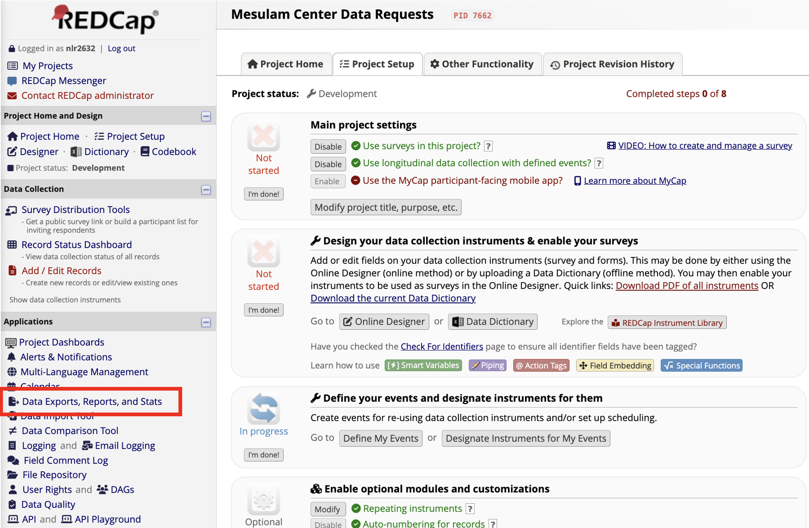
```
3. On the next page, click on the ‘+ Create New Report’ tab.
```{r, echo=FALSE, fig.cap="", out.width = '100%', out.extra='style="background-color: #41444B; padding:2px;"', fig.align = 'center'}
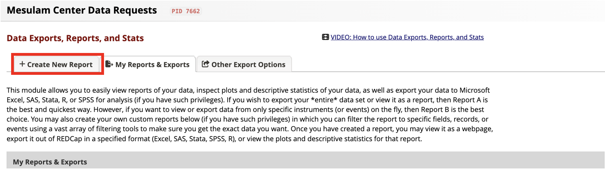
```
4. Enter information about the New Report.
    a. Enter a Name of Report. 
        i. Ex: All PPA Data Requests, Neuropath In-Progress, Nina-Completed
    b. Optional: Enter a brief Description of the Report.
```{r, echo=FALSE, fig.cap="", out.width = '100%', out.extra='style="background-color: #41444B; padding:2px;"', fig.align = 'center'}
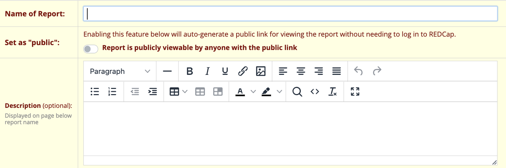
```
5. Select User Access.
    a. Select if All users or Custom users can view the report.
    b. Select if All users or Custom users can edit the report.
```{r, echo=FALSE, fig.cap="", out.width = '100%', out.extra='style="background-color: #41444B; padding:2px;"', fig.align = 'center'}
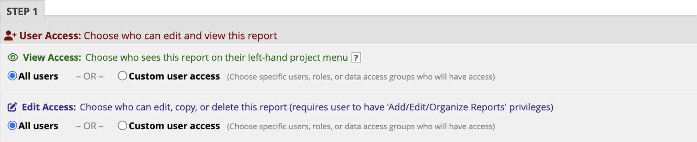
```
6. Select all fields you would like to include in the report. 
    a. Below is an example of common fields to include in reports that will provide adequate information about the data request and the progress made for each request. 
```{r, echo=FALSE, fig.cap="", out.width = '100%', out.extra='style="background-color: #41444B; padding:2px;"', fig.align = 'center'}
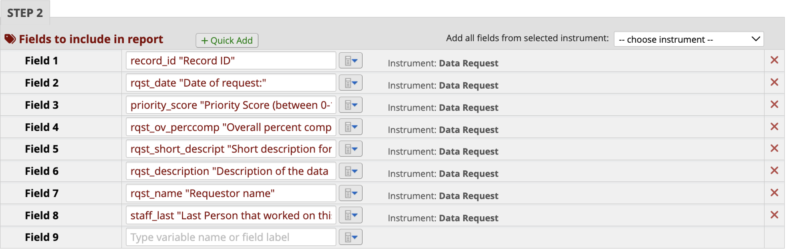
```
7. Select additional options for your report.
```{r, echo=FALSE, fig.cap="", out.width = '100%', out.extra='style="background-color: #41444B; padding:2px;"', fig.align = 'center'}
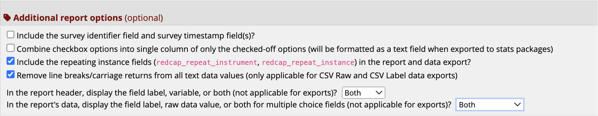
```
8. Add filters to filter the report to specific staff or studies/departments that last worked on the data request. 
    a. Add the filter for the variable ‘study_last’ and select which study to filter.
    b. To view a particular staff members’ open requests, add the filter for the variable ‘staff_last’ and select which staff member(s) to filter. 
```{r, echo=FALSE, fig.cap="", out.width = '100%', out.extra='style="background-color: #41444B; padding:2px;"', fig.align = 'center'}
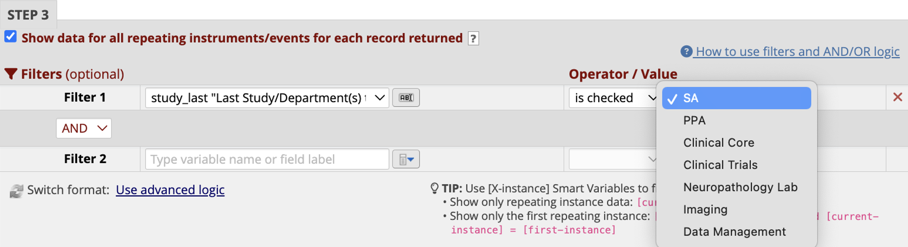
```
9. Optional: Live Filters
    a. Live filters can be used after the report has been generated. 
    b. Ex: Adding the variable ‘data_request_complete allows the user to filter by complete statuses after the report has been generated. 
```{r, echo=FALSE, fig.cap="", out.width = '100%', out.extra='style="background-color: #41444B; padding:2px;"', fig.align = 'center'}
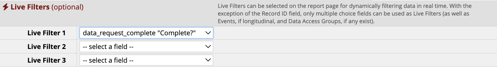
```
10. Optional: Determine your preferred ordering of the results. 
    a. Ex: Sort the results first by priority (‘priority_score’) then status (‘rqst_ovstatus’).
```{r, echo=FALSE, fig.cap="", out.width = '100%', out.extra='style="background-color: #41444B; padding:2px;"', fig.align = 'center'}
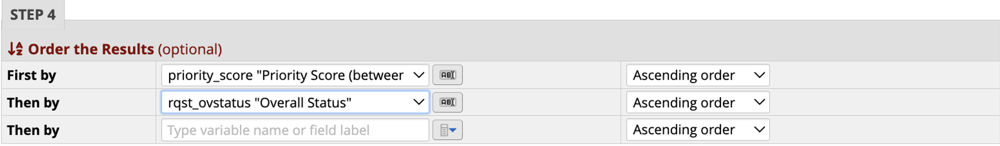
```
11. Click the Save Report button. A new screen will open up. Click View report to view. 
```{r, echo=FALSE, fig.cap="", out.width = '100%', out.extra='style="background-color: #41444B; padding:2px;"', fig.align = 'center'}
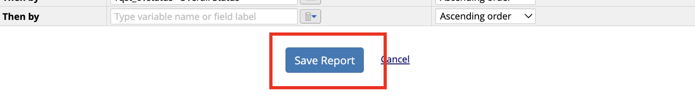
```
```{r, echo=FALSE, fig.cap="", out.width = '100%', out.extra='style="background-color: #41444B; padding:2px;"', fig.align = 'center'}
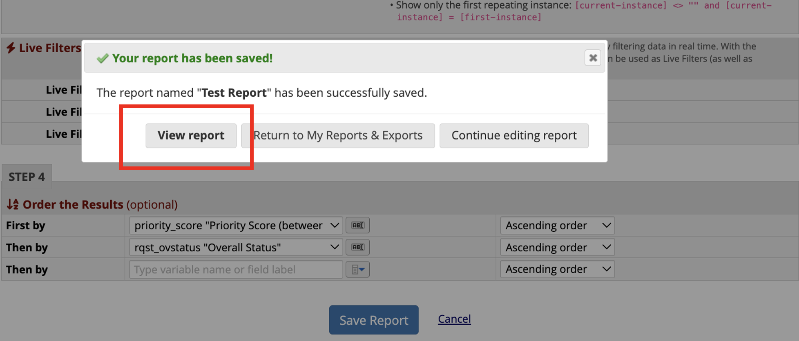
```
12. To view a report previously created, navigate to the ‘My Reports and Exports’ tab from the Reports Page. From here, you can view or export any reports. You can also navigate to the previously created reports from the sidebar. 
```{r, echo=FALSE, fig.cap="", out.width = '100%', out.extra='style="background-color: #41444B; padding:2px;"', fig.align = 'center'}
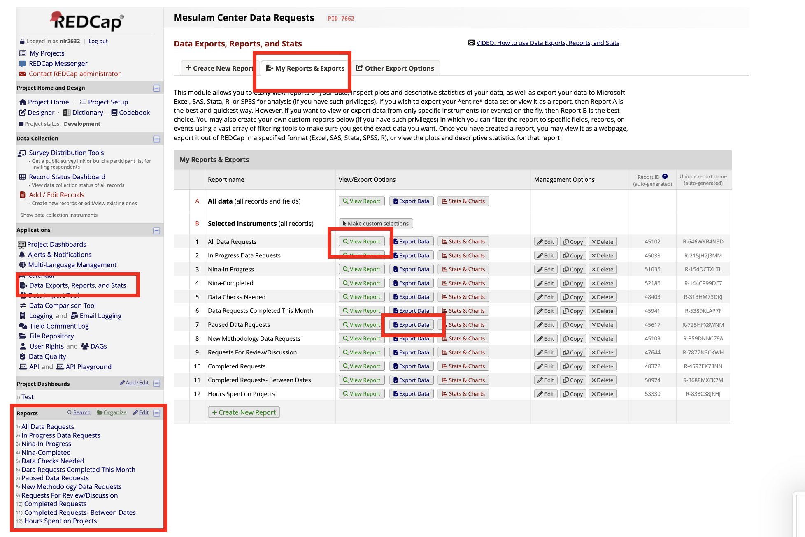
```


