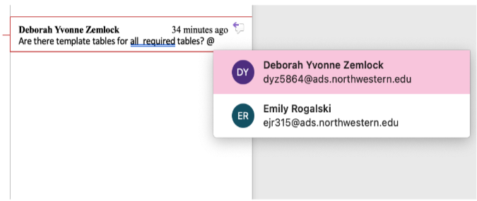
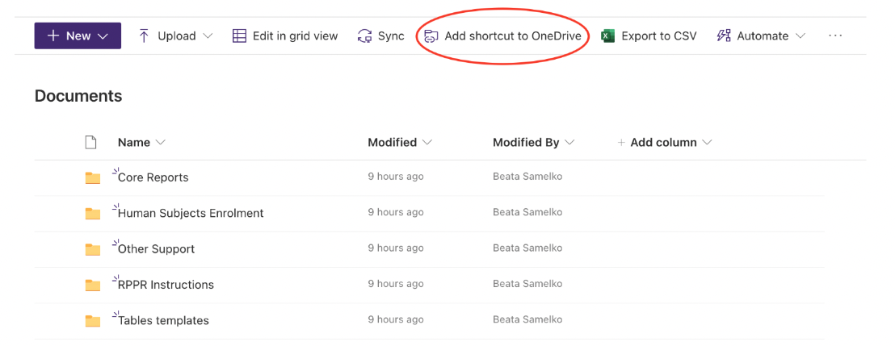
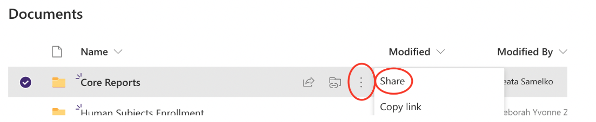
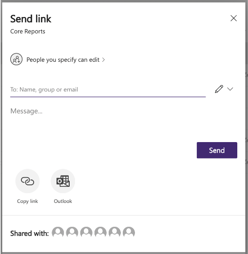
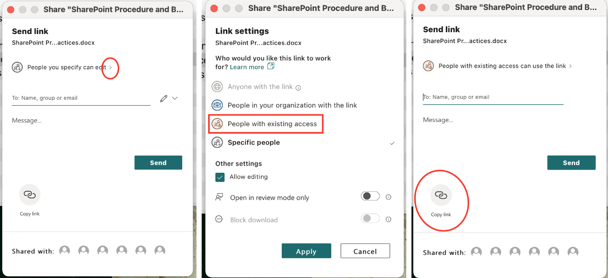
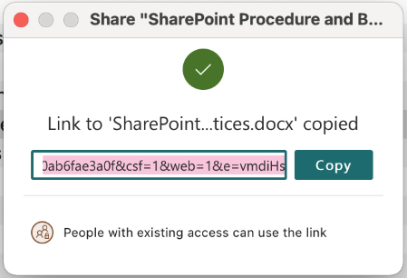

# SharePoint SOP 

SharePoint will be used to create, save, edit, and collaborate on files. 

## Access SharePoint Files Online
1. Go to your [SharePoint Homepage](https://nuwildcat.sharepoint.com/_layouts/15/sharepoint.aspx).
2. Select the desired SharePoint, which will contain all folders and files.
3. All word and excel files will open through office 365 in your browser.  
4. For collaboration, avoid downloading file and re-uploading to SharePoint. Instead edit the file in your browser or download SharePoint to your local drive (see the “Download SharePoint to your local drive” section below).   

## Collaborating within Word and Excel Documents
1. When adding comments, notes or questions in Word or Excel, type “@” and start typing the name of the person responsible for addressing the comment. A list of options will appear, click a name to send an alert of the comment. The person will receive an email with the question or comment included and can reply directly in the email or can go to the document to address the issue. 
```{r, echo=FALSE, fig.cap="", out.width = '70%', out.extra='style="background-color: #41444B; padding:2px;"', fig.align = 'center'}

```

## Auto Saving Files in SharePoint 
1. When collaborating in SharePoint files, all edits are auto saved 
    a. Best practices should include saving “check point” files along the way when collaborating on a project that requires multiple rounds of review so that past versions of the document can be easily found if needed.  
    b. When collaborating on a file that is auto saved, turn on track changes so that everyone knows who made each change. 
    
## Download SharePoint to your Local Drive
1. To download a SharePoint folder to your local drive, you must already have OneDrive on your machine.  
    a. [Download OneDrive for Mac](https://services.northwestern.edu/TDClient/30/Portal/KB/ArticleDet?ID=1683) 
    b. [Download OneDrive for Windows](https://services.northwestern.edu/TDClient/30/Portal/KB/ArticleDet?ID=1682) 
2. Once you have access to OneDrive on your Machine, go to the SharePoint Documents Page. 
3. At the top of the page, click “Add shortcut to OneDrive”.
```{r, echo=FALSE, fig.cap="", out.width = '100%', out.extra='style="background-color: #41444B; padding:2px;"', fig.align = 'center'}

```
4. Within a few minutes, a new folder should appear in your OneDrive for the SharePoint Documents folder you added. 
5. Once this “Documents” folder is added to your local drive, you can create files and edit files without interacting with the web interface. 
6. All files edited in Word and Excel will be auto saved to SharePoint.  

<b>IMPORTANT:</b> If you drag a file from your local SharePoint to your desktop, that file will be deleted for everyone on SharePoint and will only exist on your machine. SharePoint works best for collaboration when all files are edited within SharePoint and office 365, downloading a file should never be necessary. Similarly, if a file is deleted on a SharePoint local drive, it is deleted for everyone. Do not delete any files in which you are not the only author.  

## Share Files
1. SharePoint Files can be shared 1 of 3 ways: User access to the full site, access to a folder, or access to a single file.  
2. For granting access to one file or folder: 
    a. In the online SharePoint: Click the three vertical dots next to any file or folder, click “Share”. 
```{r, echo=FALSE, fig.cap="", out.width = '100%', out.extra='style="background-color: #41444B; padding:2px;"', fig.align = 'center'}

```
    b. In SharePoint on a local drive, right click on the file or folder and click “Share”.  
    c. In both cases, the same dialog box will appear.  
        i. Enter the email address in the “To:” field to share the file or folder. 
```{r, echo=FALSE, fig.cap="", out.width = '70%', out.extra='style="background-color: #41444B; padding:2px;"', fig.align = 'center'}

```
        ii. An email will be sent to the entered email address with an invitation to the file or folder.  
        iii. The link to the file can also be copied and sent separately by clicking “Copy link” at the bottom of the dialog box.  

## Copy the Link to a File or Folder
1. In the online SharePoint: Click the three vertical dots next to any file or folder, click “Copy link”. 
2. In SharePoint on a local drive, right click on the file or folder, then click “Share”. The same “send link dialog box will appear.  
3. Copy the link by selecting “People with existing access” instead of “People you specify…”, then click “Apply”, and finally click “Copy link”.  
```{r, echo=FALSE, fig.cap="", out.width = '100%', out.extra='style="background-color: #41444B; padding:2px;"', fig.align = 'center'}

```
```{r, echo=FALSE, fig.cap="", out.width = '60%', out.extra='style="background-color: #41444B; padding:2px;"', fig.align = 'center'}

```


