# Ripple SOP 

## Ripple General SOP
1. Ripple Science
    a. Ripple Science is a web-based software for CROs, Principal Investigators, and Project Coordinators that aids in participant recruitment and management.
    b. Ripple Science can be reached by navigating to [https://mesulamcenter.ripplescience.com](https://mesulamcenter.ripplescience.com). For access to Ripple, contact the data manager or the project manager.

## Registry 
```{r, echo=FALSE, fig.cap="", out.width = '100%', out.extra='style="background-color: #41444B; padding:2px;"', fig.align = 'center'}

```
<br/>

1. The registry includes all individuals who have expressed interest in the Mesulam Center, such as research participants, caregivers in support groups, those screened but deemed ineligible, etc. 
2. The registry is sorted by last name, with the participant's name in the first column, followed by studies they're enrolled in, sex, age, and last contact. 
```{r, echo=FALSE, fig.cap="", out.width = '100%', out.extra='style="background-color: #41444B; padding:2px;"', fig.align = 'center'}
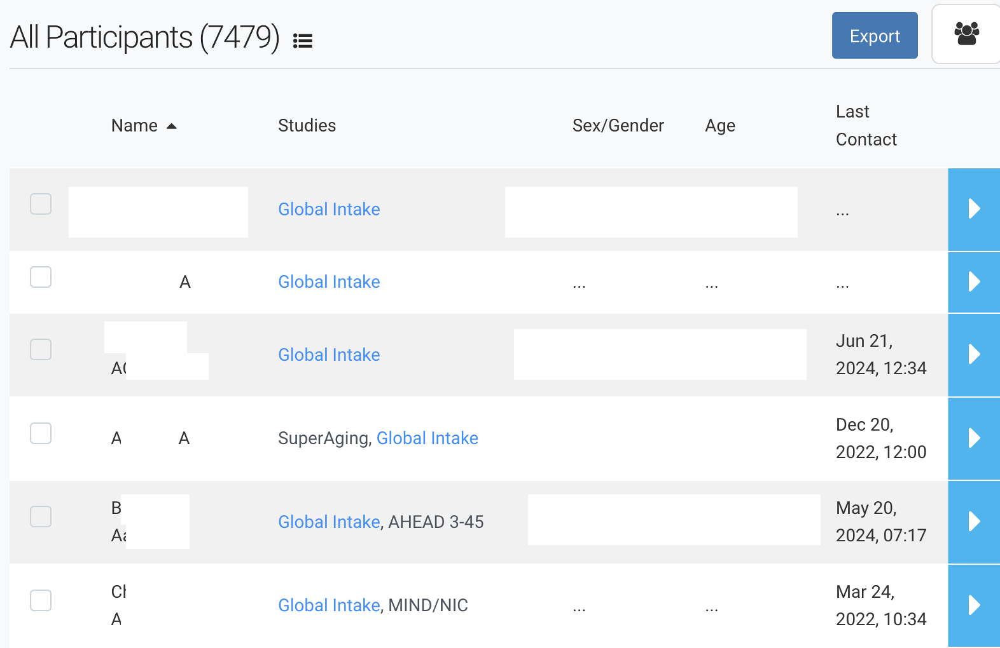
```
5. Search for a participant:
    a. To search for a specific participant, search either the last name, first name or global ID, the 15-17 alphanumeric unique identifier for each person in the Ripple database.
<br/>
```{r, echo=FALSE, fig.cap="", out.width = '70%', out.extra='style="background-color: #41444B; padding:2px;"', fig.align = 'center'}
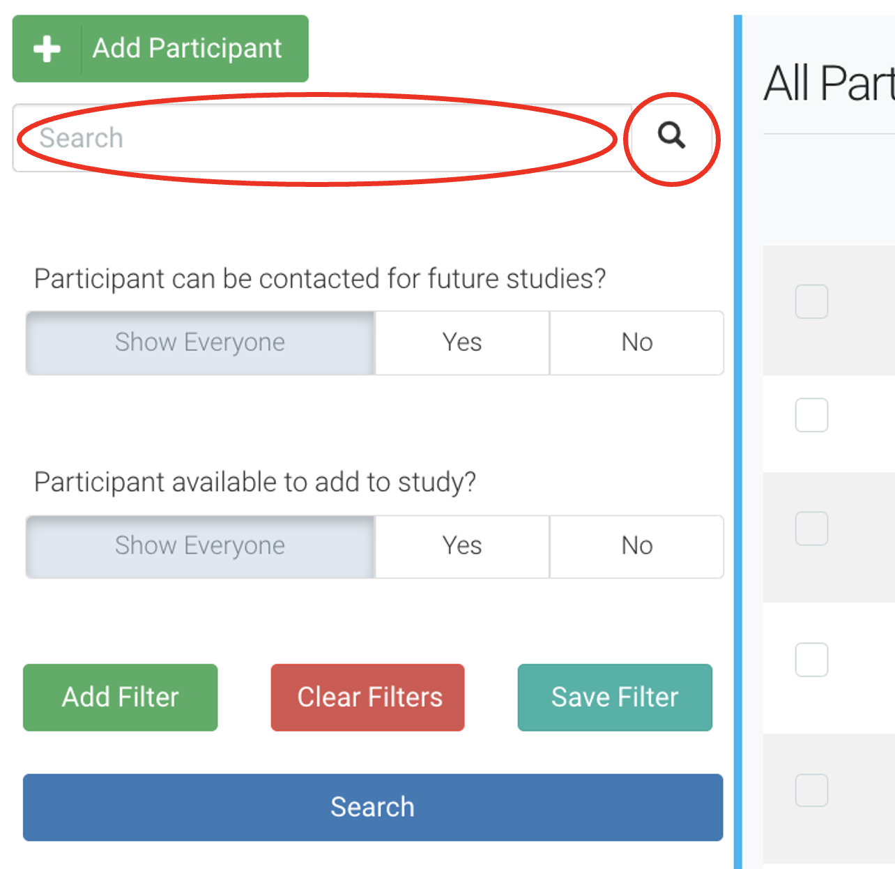
```
<br/>
    b. For more information click the arrow in blue to the right of each participant.
<br/>
```{r, echo=FALSE, fig.cap="", out.width = '100%', out.extra='style="background-color: #41444B; padding:2px;"', fig.align = 'center'}
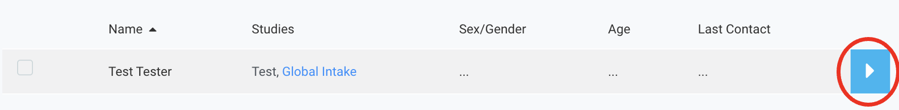
```
<br/>
    c. To search for a group of potential participants that all meet the same criteria, you can filter the registry. 
        i. The below example search is for the number of people that were added to the Ripple registry from 1/1/23 until the date the report was filtered, are above 80 years old, and have not already been added to the SuperAging study. This resulted in 293 participants.
```{r, echo=FALSE, fig.cap="", out.width = '100%', out.extra='style="background-color: #41444B; padding:2px;"', fig.align = 'center'}
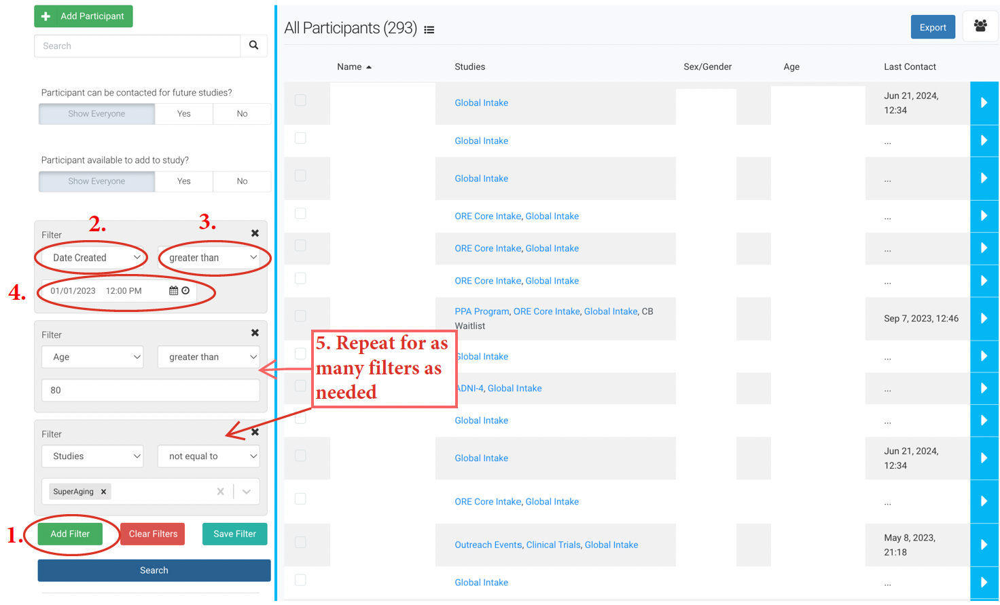
```
    d. Adding participants to a study:
        i. Click the check box next to the name of all participants you want to add to a study. Select the study from the dropdown menu at the top and click "Apply".
<br/>
```{r, echo=FALSE, fig.cap="", out.width = '70%', out.extra='style="background-color: #41444B; padding:2px;"', fig.align = 'center'}
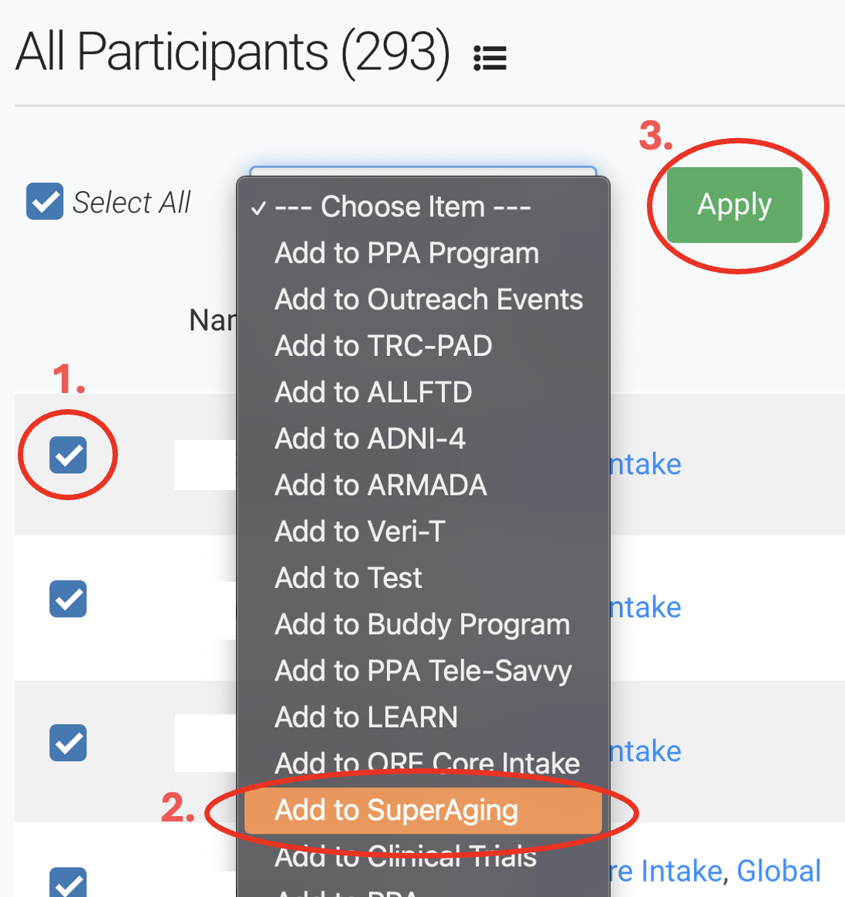
```

## Studies 
1. Each study recruiting participants at the Mesulam Center has a separate Ripple page. To navigate to a study, go to “select study” in the upper left hand of the page. 
<br/>
```{r, echo=FALSE, fig.cap="", out.width = '70%', out.extra='style="background-color: #41444B; padding:2px;"', fig.align = 'center'}

```
<br/>
2. Study Coordinators and Research Assistants will only have access to those studies that they are IRB approved to work on. 
3. Only participants that have been added to each study will be visible on each study page. 
4. When you go to a study, you will see different tabs across the top: Dashboard, Tasks, Recruitment, Calendar, Potential Participants, and Enrolled Participants. 

## Header Tabs
### Dashboard 
```{r, echo=FALSE, fig.cap="", out.width = '100%', out.extra='style="background-color: #41444B; padding:2px;"', fig.align = 'center'}
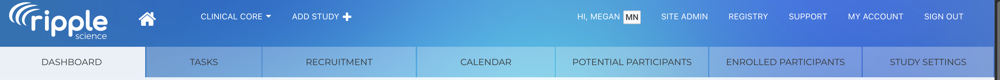
```

1. The Dashboard provides an overview of the study’s recruitment progress as well as analytic insights for recruitment.

### Tasks
1. Scheduling and recruitment tasks can be assigned to different team members in the Tasks tab.
2. The Tasks tab will have all of the tasks currently assigned for the whole team. 
3. To see your individual tasks, go out of the study, to your ripple home page:
```{r, echo=FALSE, fig.cap="", out.width = '70%', out.extra='style="background-color: #41444B; padding:2px;"', fig.align = 'center'}

```

### Recruitment
1. The Recruitment tab allows updates to sources and strategies for recruitment tracking. This page is specific to one study and isn't used since recruitment is tracked center-wide for all Mesulam Center studies. 

### Calendar
1. The third tab is the Calendar page. The calendar page shows all upcoming visits.
    a. Google calendar to Ripple Integration:
        i. Currently the PPA, Clinical Core, and SuperAging are automatically linking visits from the google calendar. 
        ii. Adding a visit to the google calendar to automatically add to Ripple:
            1. Title in Google Calendar: #Ripple Custom ID [Event Abbreviated Name] 
```{r, echo=FALSE, fig.cap="", out.width = '50%', out.extra='style="background-color: #41444B; padding:2px;"', fig.align = 'center'}
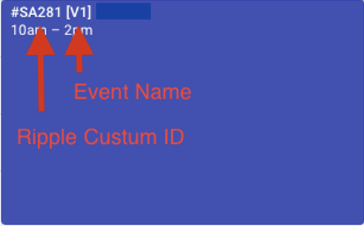
```
            2. When the Google Calendar title is in this format, the visit is logged as scheduled in Ripple. 
            <br/>
```{r, echo=FALSE, fig.cap="", out.width = '50%', out.extra='style="background-color: #41444B; padding:2px;"', fig.align = 'center'}
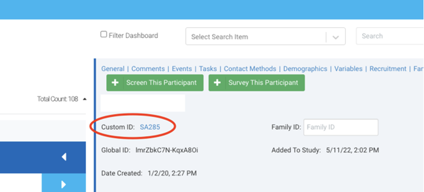
```
            3. To find the custom ID, go to the participant contact card in the potential participants or enrolled participants tab. If the participant does not have a custom ID, one must be created before scheduling on the google calendar. If the custom ID is blank, the visit will not connect from the google calendar. 
            4. Once the there is a result for the Event, add the result to the end of the title (Complete, Rescheduled, Canceled, No Show).
            
### Potential Participants
1. The Potential Participants tab is where any participant added to the ripple study, but not enrolled yet, will be organized and managed.
2. Participants will be organized into one of several statuses that are defined for each study. 

### Enrolled Participants
1. Once the participant is scheduled and comes in for the visit, they are moved to the Enrolled Participants tab. 
2. Participants will be organized into one of several statuses that are defined for each study.
3. Common Status for Enrolled are: Active, Inactive/No Longer Pursuing, Deceased. 

### Study Settings 
1. The Study Settings tab allows editing of display, statuses, and features. Study Coordinators and Research Assistants should not make any changes here. All requests should go to the study manager.

## Adding Participants
1. **<span style="color:red">Before adding a new participant, search the registry first to determine if an individual has already been added to Ripple.</span>** 
```{r, echo=FALSE, fig.cap="", out.width = '100%', out.extra='style="background-color: #41444B; padding:2px;"', fig.align = 'center'}

```
    a. Once an individual is identified within the registry, they can be added to a study by selecting the checkmark next to their name and utilizing the dropdown menu at the top of the page.
<br/>
```{r, echo=FALSE, fig.cap="", out.width = '50%', out.extra='style="background-color: #41444B; padding:2px;"', fig.align = 'center'}

```
2. If an individual cannot be found within the registry, they will need to be directly added to a study. 
    a. This can be done by navigating OUT of the registry and into a specific study (through the study dropdown in the upper left corner of Ripple). Go to the Potential Participants tab and select “Survey Participant”. **<span style="color:red">Do not select “Add Participant”.</span>**
```{r, echo=FALSE, fig.cap="", out.width = '100%', out.extra='style="background-color: #41444B; padding:2px;"', fig.align = 'center'}
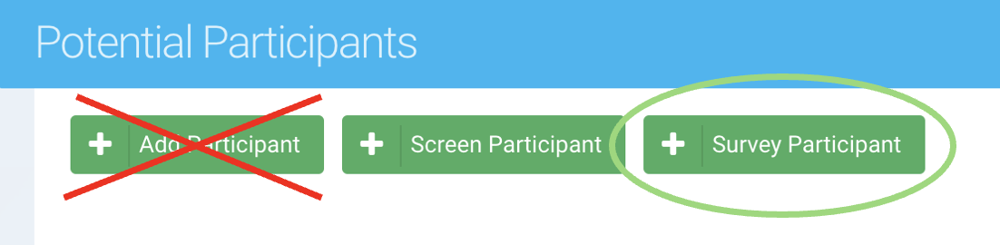
```
    b. A dropdown will appear with the list of surveys available. Choose the “Add/View Participant” Survey, then click “open”
```{r, echo=FALSE, fig.cap="", out.width = '100%', out.extra='style="background-color: #41444B; padding:2px;"', fig.align = 'center'}
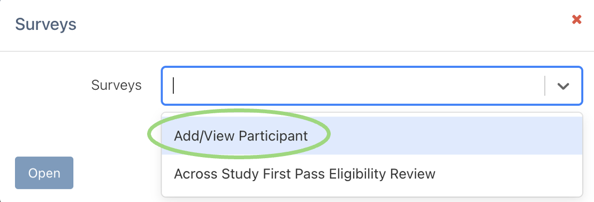
```
    c. A pop-up window will then appear. Enter the first name, last name, preferred name (if applicable), and the status that they will enter the study as.
    d. Only the participant's first and last name are required. If unknown, use the first and last name of a connected person, adding an asterisk to both names. You can update the names later in the participant's record. 
```{r, echo=FALSE, fig.cap="", out.width = '100%', out.extra='style="background-color: #41444B; padding:2px;"', fig.align = 'center'}
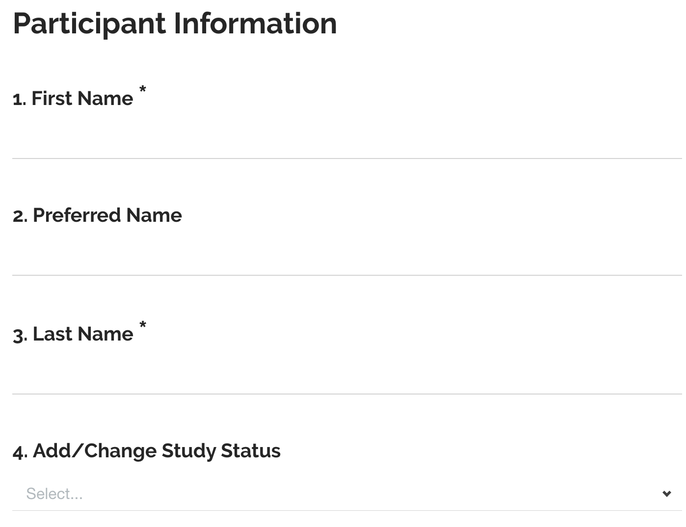
```
    e. Then you will be asked what other information you have for this participant. Select all that apply. 
```{r, echo=FALSE, fig.cap="", out.width = '100%', out.extra='style="background-color: #41444B; padding:2px;"', fig.align = 'center'}
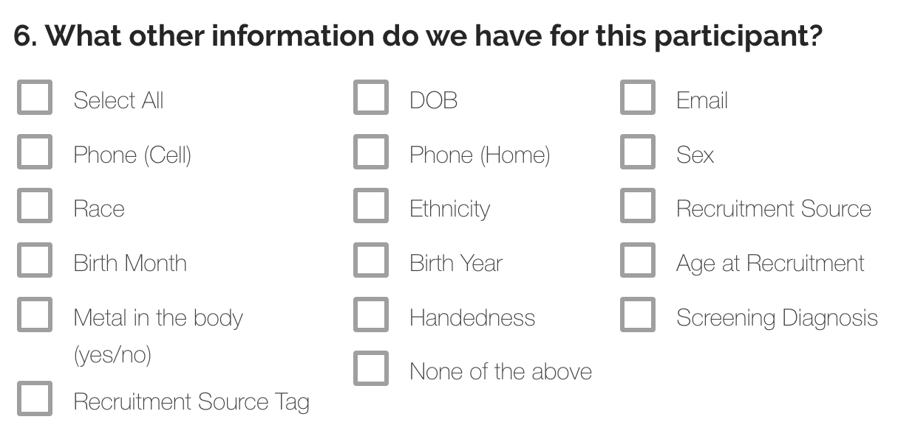
```
    f. For each selected, questions will appear to collect the information for the participant. Be sure to enter as much information for the participant as possible. 
    g. The last question is whether we can add them to our mailing list. 
    h. Once this survey is complete, the information saved in the survey can be viewed in the participant contact card see below for more information. 
    
## View Participant Record
1. To access a participant’s record, click the blue arrow next to their entry (in either potential participants or enrolled participants in any study or in the registry).
```{r, echo=FALSE, fig.cap="", out.width = '100%', out.extra='style="background-color: #41444B; padding:2px;"', fig.align = 'center'}

```
2. There are 9 sections to the record:

### General
```{r, echo=FALSE, fig.cap="", out.width = '100%', out.extra='style="background-color: #41444B; padding:2px;"', fig.align = 'center'}
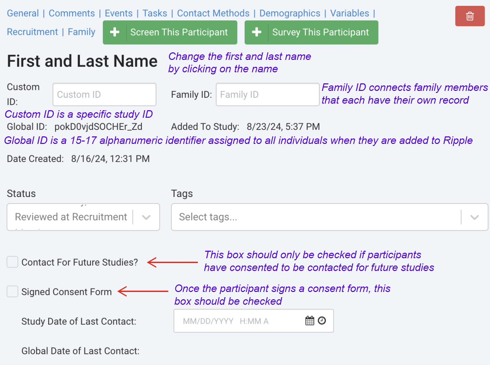
```
    
### Comments/Email/Contact/Consent/Forms 
1. Comments
    a. All comments are automatically logged as global, meaning they are visible to all studies. If a comment needs to be available to only the current study, unselect the “Global” box. 
    b. Pinned comments will appear at the top of the contact log.
```{r, echo=FALSE, fig.cap="", out.width = '80%', out.extra='style="background-color: #41444B; padding:2px;"', fig.align = 'center'}
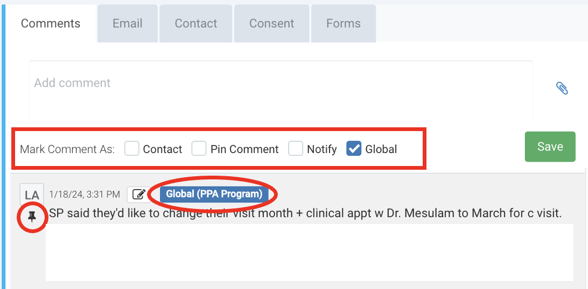
```
2. Email
    a. All emails sent through Ripple will be seen here. See below for how to send emails or bulk emails through Ripple. 
    b. All emails should also be logged as a contact attempt, by checking the box for “log as contact attempt” when writing the email. 
3. Contact Attempts
    a. The Contact tab is where all contact attempts made by the study team or received from a participant or study partner are logged.
    b. Tracking participant outreach and responses is essential for scheduling and understanding recruitment science. 
    c. All contact attempts should be documented within Ripple and marked as global.
    d. One contact attempt needs to be logged for any phone call, email, or text message sent. 
    e. Ongoing email or text message conversations about a singular topic need only be documented as two contacts, one contact logged documenting that we reached out and one contact logged that the participant responded. 
    f. All phone calls should be documented individually along with their outcomes.
```{r, echo=FALSE, fig.cap="", out.width = '100%', out.extra='style="background-color: #41444B; padding:2px;"', fig.align = 'center'}
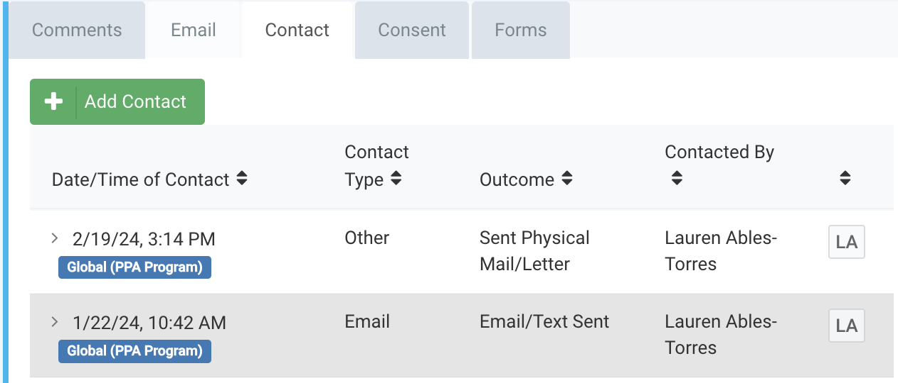
```
    g. Below is an example contact attempt log: 
```{r, echo=FALSE, fig.cap="", out.width = '70%', out.extra='style="background-color: #41444B; padding:2px;"', fig.align = 'center'}
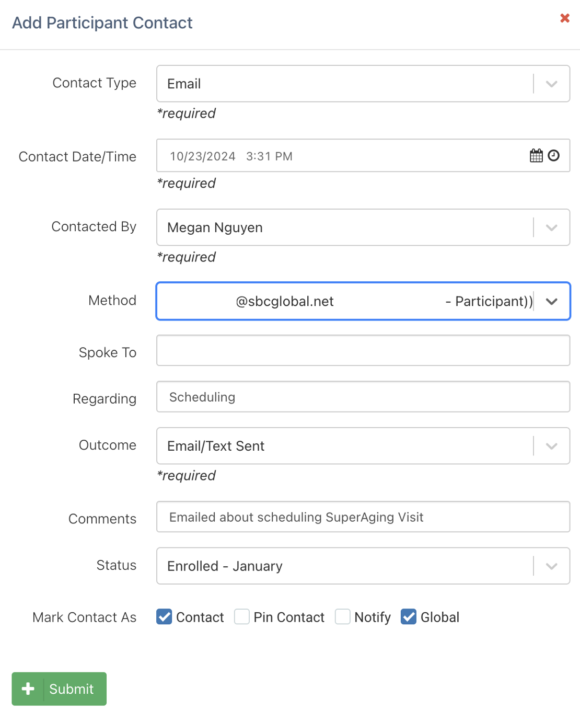
```
    h. Regarding: Only Enter the Below Categories to better track why we are contacting participants:
        i. Screening 
            * All contact before enrollment. 
        ii.	Scheduling
        iii. ADRC Informant Only Call
        iv.	Brain Donation
        v. Information sent during/after visit
        vi.	Check-in/Psychosocial Pathway
        vii. Adverse Events
        viii.	Study Retention Events 
        ix.	Media Opportunities
        x. Moving Enrollment Groups
            * Participant moving from one group to another (in person to victual participation)
        xi.	MRI- Imaging Core
            * This category is reserved for the imaging team reaching out to participant. All MRI scheduling contact by the study team is logged as “scheduling”.
    j. Outcome: Contact attempt outcomes should be documented in each contact attempt to accurately capture recruitment efforts. The following outcomes will be made standard in each Ripple study: Spoke to Participant, Spoke to Study Partner, Left Voicemail, Other.
4. Consent Log 
    a. The consent log is not used for any studies. In the general section, check that consent has been signed and log the date. 
5. Forms
    a. PDFs of all completed surveys and screeners can be downloaded from here. 

### Events
1. This is where different visits are listed for each study. Completed and upcoming visits can be viewed here. 

### Tasks
1. All tasks associated with this participant will be shown here. 

### Contact Information
1. The participant and each study partner should have contact information listed within the participant’s contact card.
2. When new information is obtained, the contact card should be updated as soon as possible. When updating the participant’s contact information archive the old information and add the new information so the old contact information is preserved. 

### Demographics
1. Lists the participant’s sex, ethnicity, race, birthday, and age.
2. Demographics should not be edited after initial completion except to correct an error.
<br/>
```{r, echo=FALSE, fig.cap="", out.width = '70%', out.extra='style="background-color: #41444B; padding:2px;"', fig.align = 'center'}
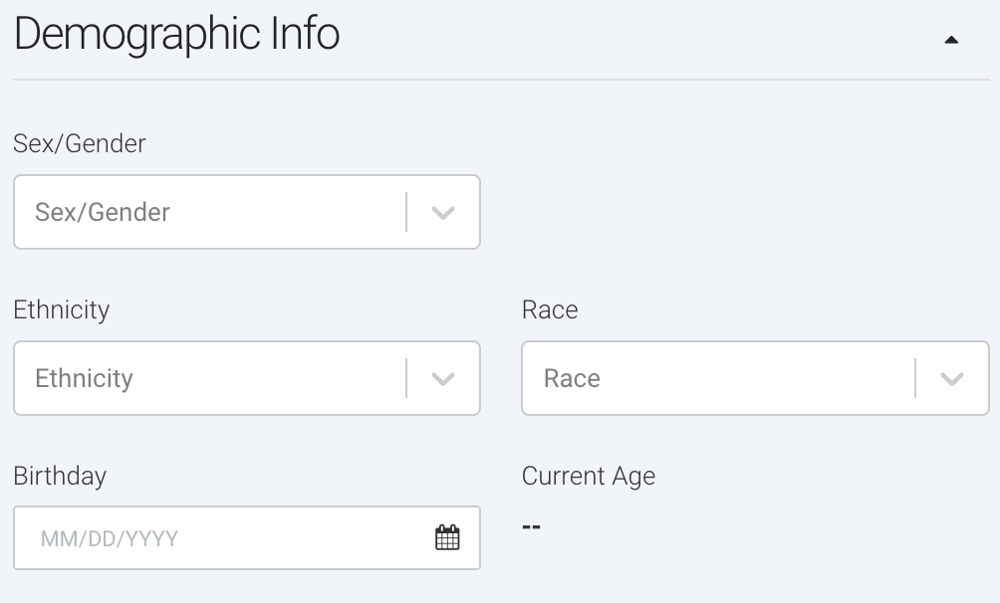
```

### Custom Variables
1. Below Demographics are Mesulam Center wide or specific study defined custom variables. This is data that is not captured in Ripple’s standard fields and features above. 
2. [Here](https://nuwildcat.sharepoint.com/:x:/s/FSM-MesulamCenterDataMgmt/EWmgquH9jwRAoISkUpz0occBBjIdNpnGjDWUw1J8TLMNsA?e=jmQDO2) is a link to all of the custom variables that are used in the Mesulam Center Ripple accompanied by a description of each variable and which study’s ripple page each variable is available in. 
3. All information completed on Ripple surveys will automatically fill in these fields if the survey is set up properly. 
<br/>
```{r, echo=FALSE, fig.cap="", out.width = '70%', out.extra='style="background-color: #41444B; padding:2px;"', fig.align = 'center'}
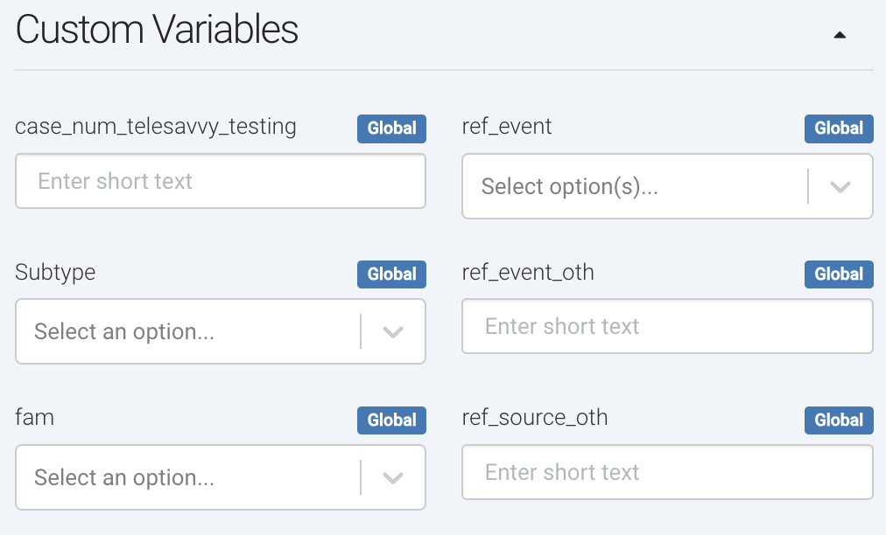
```

### Recruitment
1. Ripple provides 3 recruitment variables that are specific to each study and cannot be universal to all studies. Because the Mesulam center needs to track how participants are recruited outside of each study, these fields cannot be used. 

### Family
1. All family members that the participant is connected to through the family ID are listed here. 

```{r, echo=FALSE, fig.cap="", out.width = '100%', out.extra='style="background-color: #41444B; padding:2px;"', fig.align = 'center'}
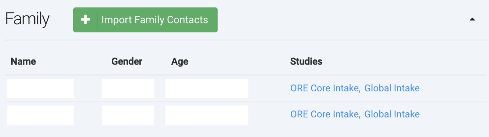
```

## First Pass Consideration
1. A “Participants Recently Added to Ripple” email is sent weekly. For each participant, update the First Pass Consideration Result and Reasons not pursuing (if any). One member from each study should complete this.
2. Navigate to the Registry. 
```{r, echo=FALSE, fig.cap="", out.width = '100%', out.extra='style="background-color: #41444B; padding:2px;"', fig.align = 'center'}

```
3. On the Registry page, search for each participant using the Ripple Global ID. 
```{r, echo=FALSE, fig.cap="", out.width = '50%', out.extra='style="background-color: #41444B; padding:2px;"', fig.align = 'center'}

```
4. Select the participant and review their record. 
5. If they meet any First Pass criteria, find your study-specific First Pass variables under the ‘Custom Variables’ section. 
6. Select the appropriate ‘First Pass Consideration Result’. 
7. If the First Pass Result is ‘Not Pursuing’, find the variable ‘Reasons not pursuing’ and select the correct option from the dropdown list.
8. If the First Pass Result is ‘Potential participant’, immediately add the participant to the appropriate study. 
    a. View the ‘Adding Participants’ section in this SOP for more information. 

## First Contact Procedure
1. Upon first contacting a participant for screening, go to the Potential Participants tab for the list of potentially eligible participants. The participants will be separated into screening statuses that are different for each study. 
2. Find a participant that needs to be contacted and click the blue arrow to the right of their name in the potential participants list. 
3. At the top of the participant’s contact card, select “Survey This Participant”.
```{r, echo=FALSE, fig.cap="", out.width = '100%', out.extra='style="background-color: #41444B; padding:2px;"', fig.align = 'center'}
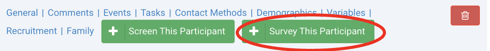
```
4. Click into the “Add/View Participant Survey”.
```{r, echo=FALSE, fig.cap="", out.width = '50%', out.extra='style="background-color: #41444B; padding:2px;"', fig.align = 'center'}

```
5. This form gives an overview of the information we have on this participant. Right after the name and status is a question asking to confirm the recruitment information. All participants should be asked to confirm how they heard about us upon the first contact. 
<br/>
```{r, echo=FALSE, fig.cap="", out.width = '70%', out.extra='style="background-color: #41444B; padding:2px;"', fig.align = 'center'}
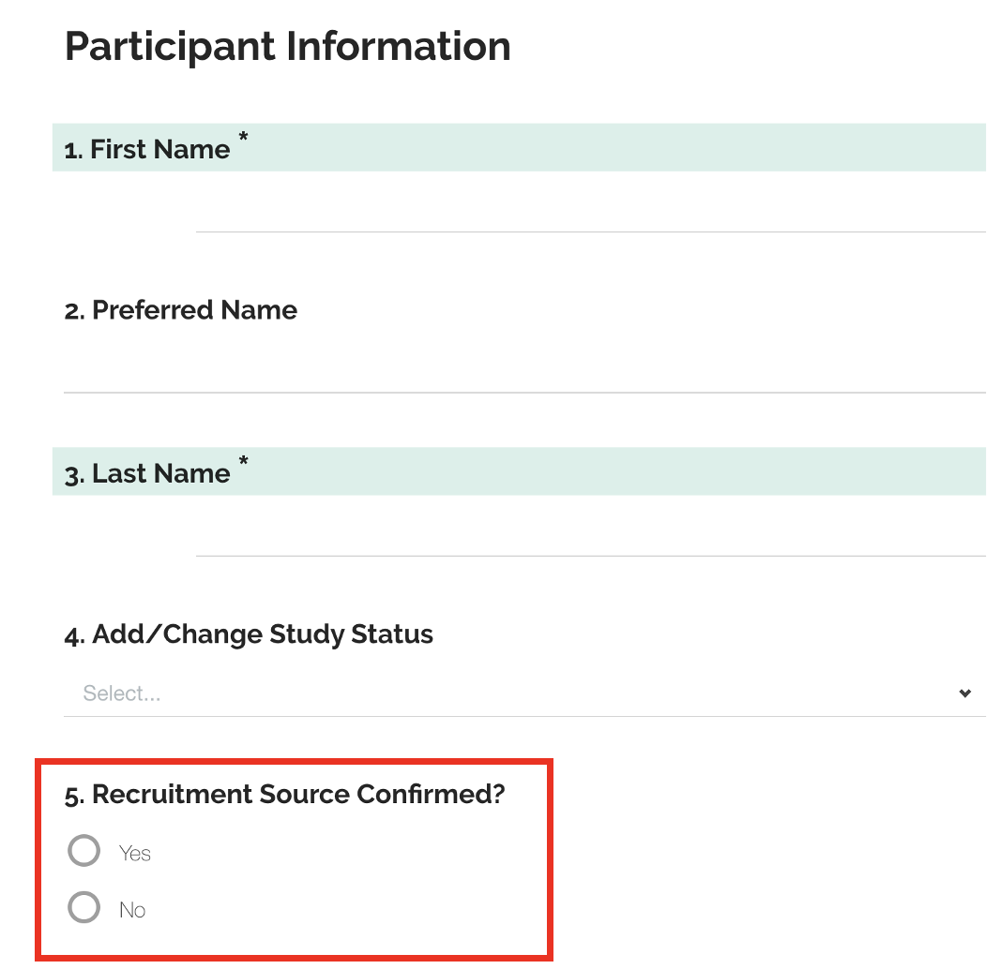
```
6. Check the current recruitment method that we have on file by scrolling down in the form. Confirm that the recruitment method we have on file is the correct recruitment method. 
<br/>
```{r, echo=FALSE, fig.cap="", out.width = '70%', out.extra='style="background-color: #41444B; padding:2px;"', fig.align = 'center'}
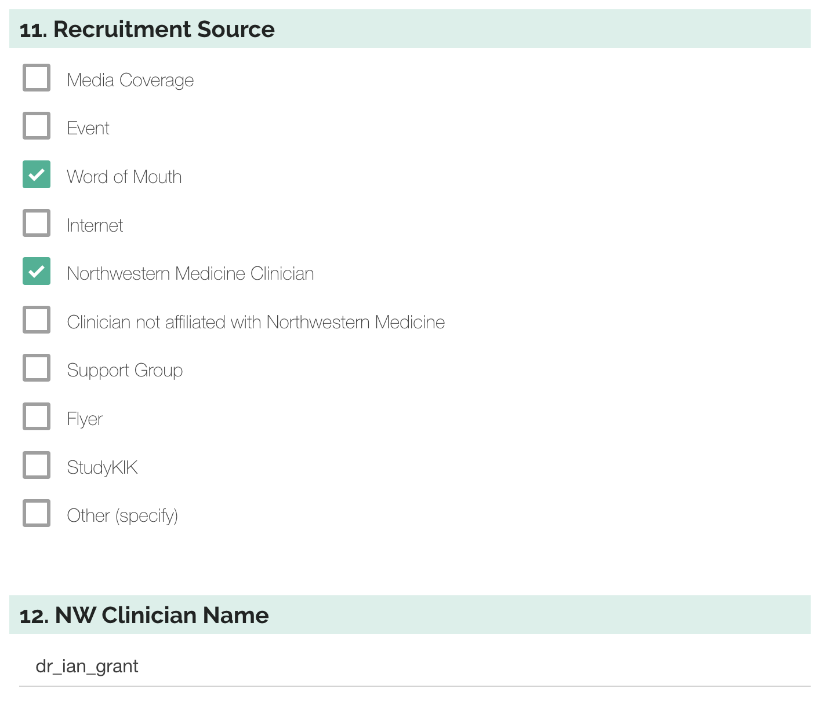
```
<br/>
7. Mark whether the recruitment method has been confirmed and add notes about the confirmation including your NetID and the date of the confirmation.
```{r, echo=FALSE, fig.cap="", out.width = '70%', out.extra='style="background-color: #41444B; padding:2px;"', fig.align = 'center'}
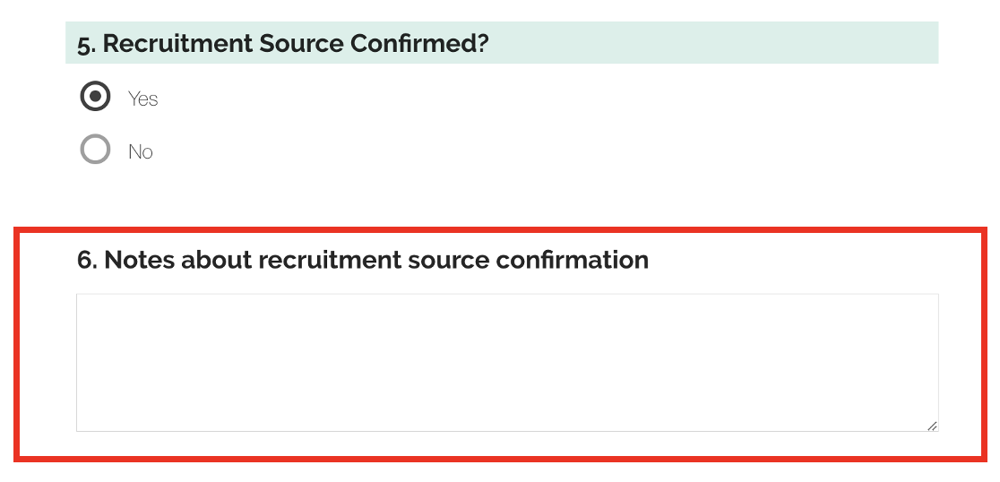
```
8. Review the rest of the form and obtain any information on the form that may still be blank. 
9. Log the contact in the Contact Log. 
10. Move them into another status if appropriate. Refer to study specific recruitment SOPs. 

## Emails/Bulk Emails
1. Navigate to the Potential Participants or Enrolled Participants tab.
2. Select the Participants you would like to receive the email communication.
    a. <b><i>Note: ‘Send Bulk Email’ option will not appear if only 1 participant is selected.</b><i/>
3. Select “Send Bulk Email” from the drop-down menu. Click apply to open the Select Bulk Email Template window. 
```{r, echo=FALSE, fig.cap="", out.width = '100%', out.extra='style="background-color: #41444B; padding:2px;"', fig.align = 'center'}
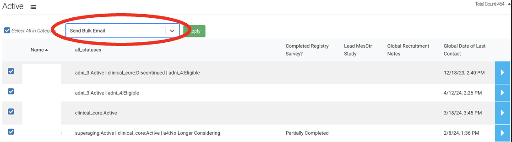
```
4. Select your desired email template from the dropdown list. 
```{r, echo=FALSE, fig.cap="", out.width = '100%', out.extra='style="background-color: #41444B; padding:2px;"', fig.align = 'center'}
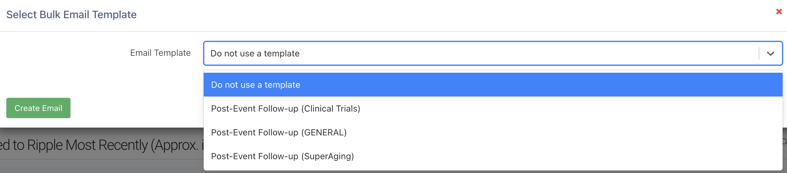
```
5. Review the email and <b><i>update the event name and event date</b><i/> fields.
6. <b>Select Contact and Global to mark update in the contact log.</b> 
```{r, echo=FALSE, fig.cap="", out.width = '100%', out.extra='style="background-color: #41444B; padding:2px;"', fig.align = 'center'}
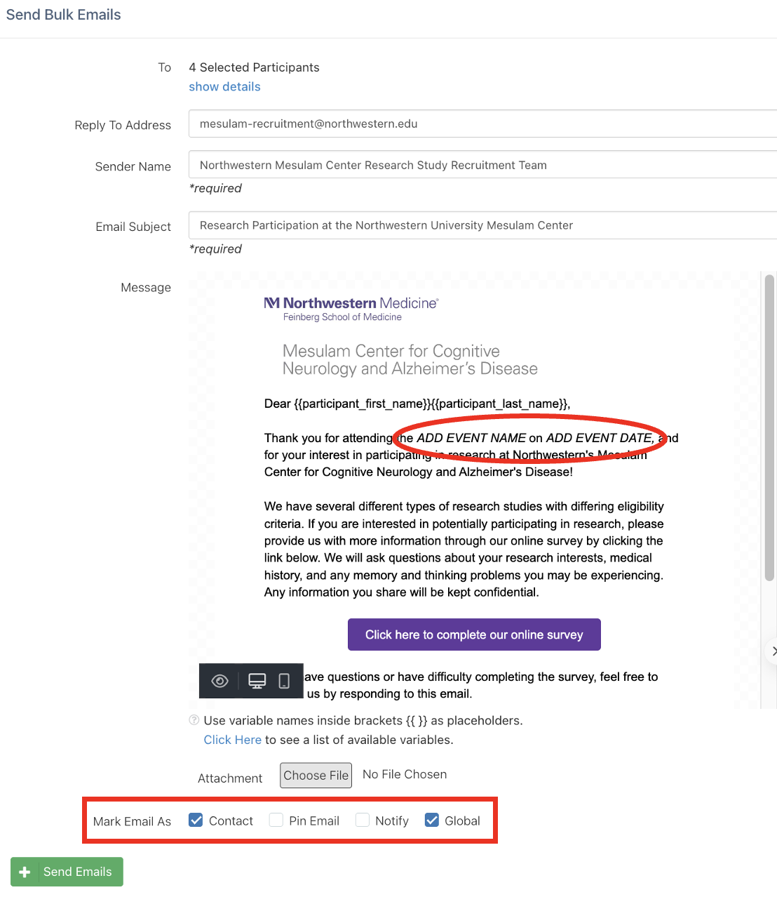
```
7. Click the “Send Emails” button to send the email to the selected participants. 

## Adding a Participant to Outreach Events
1. Search the participant's last name in the Registry.
2. If the participant is already in the registry:
    a. Add them to the “Outreach Events” page by checking the box next to their name and using the dropdown menu at the top.  
    b. Open the “Event Card Intake” Survey to review the information we currently have on the participant and see if anything needs to be updated.  
3. If the participant is not already in the registry: 
    a. Go to the Outreach Events page in Ripple 
    b. Go to the Potential Participants page.  
    c. Click “Survey Participant” and open the “Event Card Intake” Survey 
```{r, echo=FALSE, fig.cap="", out.width = '50%', out.extra='style="background-color: #41444B; padding:2px;"', fig.align = 'center'}
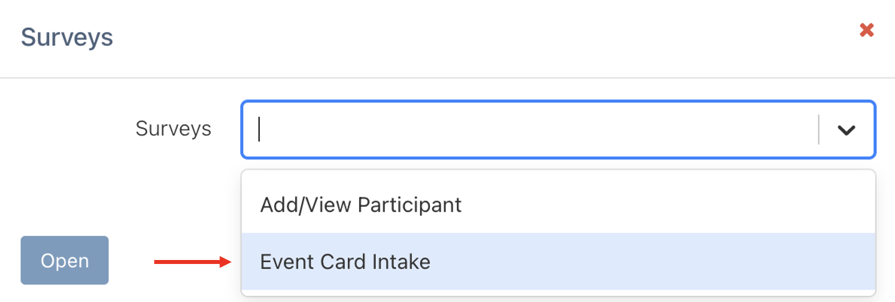
```
    d. Add all information known about the new potential participant from the intake card that was filled out at the event.  
4. Send out the registry survey link to everyone that has not already completed it: 
    a. All participants will default to "Registry Link not Sent" in the Potential Participants page. 
    b. Check the box next to the first participant in the “Registry Link not Sent” category.  
    c. At the top of this section, check the “Select All in Category” check box.  
    d. From the dropdown, choose "Send Bulk Email" and click "Apply". 
    e. Select the appropriate email template: General, Clinical Trials, or Super Aging and click "Create Email".
    f. Once open, add event name and event date in the body of the email.  
    g. In the “Mark Email As” section, mark the email as a Contact and Global.  
    h. Click “Send Emails” 
5. Move all participants that have been sent an email to the status of “Registry Link Sent via Email”. 
<br/>
```{r, echo=FALSE, fig.cap="", out.width = '70%', out.extra='style="background-color: #41444B; padding:2px;"', fig.align = 'center'}
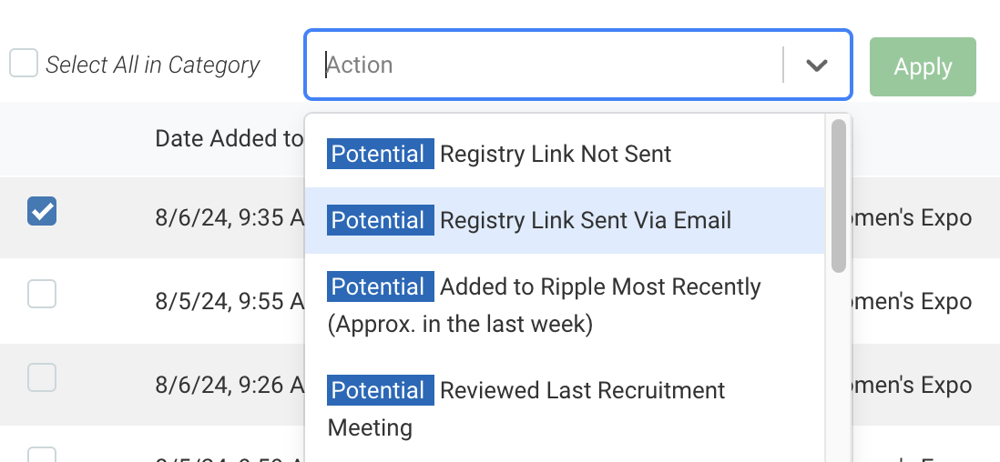
```
6. **NOTE: Every Friday, participants will be moved out of the status of “Registry Link Sent via Email” to a status that represents where they are in the recruitment process.**


