--- 
title: "Mesulam Center Data Management Practices"
author: "Nina Reiser"
date: "`r Sys.Date()`"
site: bookdown::bookdown_site
---


# Introduction

This website serves as a repository for all data management SOPs that are used
within the Northwestern University Mesulam Center for Cognitive Neurology &
Alzheimer's Disease. 

## How to Use the Site
Navigate the SOPs in the Table of contents on the left panel. Navigate chapters
within an SOP on the right panel. Search for a specific SOP by using the search 
bar located above the Table of contents on the left panel. 

### Navigating Pages
Navigate to the next SOP by clicking on the next page button at the bottom of 
the text. 

```{r, echo=FALSE, fig.cap="", out.width = '20%', out.extra='style="background-color: #41444B; padding:2px;"', fig.align = 'center'}
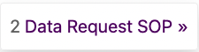
```

Navigate to the previous SOP by clicking on the previous page button at the 
bottom of the text. 

```{r, echo=FALSE, fig.cap="", out.width = '20%', out.extra='style="background-color: #41444B; padding:2px;"', fig.align = 'center'}
knitr::include_graphics("previous_page_button.png")
```


<!--chapter:end:index.Rmd-->

# Ripple SOP 

## Ripple General SOP
1. Ripple Science
    a. Ripple Science is a web-based software for CROs, Principal Investigators, and Project Coordinators that aids in participant recruitment and management.
    b. Ripple Science may be accessed by navigating to [https://mesulamcenter.ripplescience.com](https://mesulamcenter.ripplescience.com). For access to Ripple, contact the data manager or the project manager.
2. When logging into ripple, you see a navigation menu running across the top. 

## Registry 
```{r, echo=FALSE, fig.cap="", out.width = '80%', out.extra='style="background-color: #41444B; padding:2px;"', fig.align = 'center'}
knitr::include_graphics("ripple_registry_tab.png")
```
<br/>

1. The registry contains all participants that have ever expressed interest in the Mesulam Center, both participants enrolled in research, caregivers enrolled in support groups, potential participants that were screened and ineligible, etc. 
2. The registry is sorted by last name. The name of the participant/potential participant is in the first column, the list of studies that they have been added to is in the second, followed by sex and age and if they have ever been contact/when was the last time they were contacted. 
```{r, echo=FALSE, fig.cap="", out.width = '100%', out.extra='style="background-color: #41444B; padding:2px;"', fig.align = 'center'}
knitr::include_graphics("ripple_all_participants.png")
```
5. Search for a participant:
    a. To search for a specific participant, search either the last name, first name or global ID, the 15-17 alphanumeric unique ripple identifier for each person in the Ripple database.
<br/>
```{r, echo=FALSE, fig.cap="", out.width = '50%', out.extra='style="background-color: #41444B; padding:2px;"', fig.align = 'center'}
knitr::include_graphics("ripple_search.png")
```
<br/>
    b. To search for a group of potential participants that all meet the same criteria, you can filter the registry. 
        i. The below example search is for the number of people that were added to the Ripple registry after 1/1/23 until the date the report was filtered (1/25/23) and are above 80 years old and have not already been added to the superaging study. This resulted in 14 participants. For these participants, you can see if they have been contacted, what age they are, and what other studies they came in from. 
        ii.	For more information click the arrow in blue to the right of each participant, to go to their contact card with all of the information about studies they have been added to, how much they have been contact, contact information, and screening information needed to determine eligibility. See more about the participant contact card below. 
        iii. If the person has been added to the global intake study, they were recruited from our online survey, if they are added to the URG Outreach study, they were recruited at a community event, and if they are not added to either, they were manually entered into the database. 
```{r, echo=FALSE, fig.cap="", out.width = '100%', out.extra='style="background-color: #41444B; padding:2px;"', fig.align = 'center'}
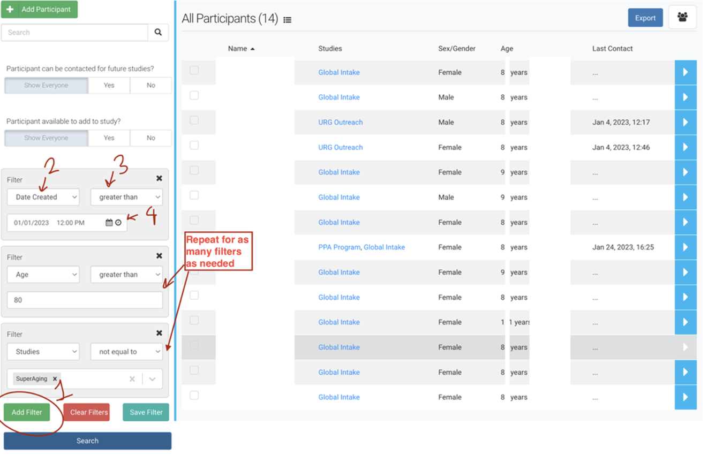
```
    c. Adding participants to a study:
        i. To add a participant to a study, click the check box next to their name, then a dropdown will appear at the top. Select the study and click apply. Multiple participants can be added to a study at one by clicking the check box next to each participant. 
<br/>
```{r, echo=FALSE, fig.cap="", out.width = '50%', out.extra='style="background-color: #41444B; padding:2px;"', fig.align = 'center'}
knitr::include_graphics("ripple_add_to_study.png")
```

## Studies 
1. Each study recruiting participants at the Mesulam Center has a separate Ripple page. To navigate to a study, go to “select study” in the upper left hand of the page. 
2. A list of the studies that you have access to will appear. 
```{r, echo=FALSE, fig.cap="", out.width = '70%', out.extra='style="background-color: #41444B; padding:2px;"', fig.align = 'center'}
knitr::include_graphics("ripple_studies.png")
```
3. To be added to a ripple study, contact the manager of that project and the data manager. 
4. Study Coordinators and Research Assistants will only have access to those studies that they are IRB approved to work on. 
5. Only participants that have been added to each study will be visible on each study page. 
6. When you go to a study, you will see different tabs across the top, dashboard, tasks, recruitment, calendar, potential participants, and enrolled participants. 

### Dashboard 
```{r, echo=FALSE, fig.cap="", out.width = '100%', out.extra='style="background-color: #41444B; padding:2px;"', fig.align = 'center'}
knitr::include_graphics("ripple_top_panel.png")
```

1. The first of several tabs, and the landing page upon login, is the Dashboard. The Dashboard provides an overview of the study’s recruitment progress as well as analytic insights for recruitment. Some studies at the Musallam center do not utilize this tab. 

### Tasks
1. The second tab is the Tasks page where scheduling and recruitment tasks can be assigned to different team members. Only the Clinical Core and PPA studies use the Tasks Tab.
2. Tasks can be anything that has been assigned to a study team member, from scheduling a participant to completing a visit, to a social work call. 
3. The tasks tab will have all of the tasks currently assigned for the whole team. 
4. To see your individual tasks, go out of the study, to your ripple home page:
```{r, echo=FALSE, fig.cap="", out.width = '50%', out.extra='style="background-color: #41444B; padding:2px;"', fig.align = 'center'}
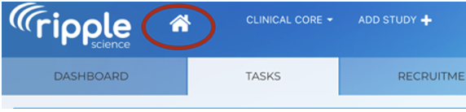
```
    a. Here you can view all of the tasks assigned to you. You can also access the report builder which will be covered later. 

### Recruitment
1. The third tab is the Recruitment page. This page is where sources and strategies may be updated for recruitment tracking purposes. This page is specific to one study and recruitment sources need to be tracked center wide, so study specific recruitment sources are not used for any Mesulam Center studies. 

### Calendar
1. The third tab is the Calendar page. The calendar page shows all upcoming visits.
    a. Google calendar to Ripple Integration:
        i. Currently the PPA, Clinical Core, and SuperAging are automatically linking visits from the google calendar. 
        ii. Adding a visit to the google calendar to automatically add to Ripple:
            1. Title in Google Calendar: #Ripple Custom ID [Event Abbreviated Name] 
```{r, echo=FALSE, fig.cap="", out.width = '50%', out.extra='style="background-color: #41444B; padding:2px;"', fig.align = 'center'}
knitr::include_graphics("ripple_calendar_title.png")
```
            2. When the Google Calendar title is in this format, the visit is logged as scheduled in Ripple. 
            <br/>
```{r, echo=FALSE, fig.cap="", out.width = '50%', out.extra='style="background-color: #41444B; padding:2px;"', fig.align = 'center'}
knitr::include_graphics("ripple_calendar_log.png")
```
            3. To find the custom ID, go to the participant contact card in the potential participants or enrolled participants tab. If the participant does not have a custom ID, one must be created before scheduling on the google calendar. If the custom ID is blank, the visit will not connect from the google calendar. 
            4. Once the there is a result for the Event, add the result to the end of the title (Complete, Rescheduled, Canceled, No Show).
            
### Potential Participants
1. The Potential Participants tab is where any participant added to the ripple study but not enrolled will be organized and managed.
2. For the 3 registry projects (Global intake, URG Outreach, and Miller Registry), all participants will be held “potential participants”, because these three projects do not enroll, but facilitate enrollment for other studies. 
3. Participants will be organized into one of several statuses that are defined for each study. 
4. Common statuses are: Not Yet Contacted, Screening In-progress, Eligible, Ineligible, Scheduled

### Enrolled Participants
1. Once the participant is scheduled and comes in for the visit, they are moved to the enrolled tab. 
2. The Enrolled Participants tab is where enrolled participants will be organized and managed.
3. Participants will be organized into one of several statuses that are defined for each study.
4. Common Status for Enrolled are: Active, Inactive/No Longer Pursuing, Deceased. 

### Study Settings 
1. The sixth and final tab is the Study Settings page. This is where things such as display, statuses, or other features may be edited. Study Coordinators and Research assistants should not make any changes or edits to the Study Settings. Requests for changes should be shared with the study manager.

## Adding Participants
1. Before adding a new participant, search the registry first to determine if an individual has already been added to Ripple. The registry can be accessed within the header.
```{r, echo=FALSE, fig.cap="", out.width = '100%', out.extra='style="background-color: #41444B; padding:2px;"', fig.align = 'center'}
knitr::include_graphics("ripple_registry.png")
```
    a. Once an individual is identified within the registry, they can be added to a study by selecting the checkmark next to their name and utilizing the dropdown menu at the top of the page.
```{r, echo=FALSE, fig.cap="", out.width = '100%', out.extra='style="background-color: #41444B; padding:2px;"', fig.align = 'center'}
knitr::include_graphics("ripple_add_participant.png")
```
2. If an individual cannot be found within the registry, they will need to be directly added to a study. 
    a. This can be done by navigating OUT of the registry and into a specific study (through the study dropdown in the upper left corner of Ripple). Go to the Potential Participants tab select “Survey Participant”. Do not select “Add Participant” because adding a participant through a survey allows for entry of more participant information. 
```{r, echo=FALSE, fig.cap="", out.width = '100%', out.extra='style="background-color: #41444B; padding:2px;"', fig.align = 'center'}
knitr::include_graphics("ripple_survey_participant.png")
```
    b. A dropdown will appear with the list of surveys available. Choose the “Add/View Participant” Survey, then click “open”
    c. A pop-up window will then appear. Enter the first name, last name, preferred name (if applicable), and the status that they will enter the study as.
    d. First and Last Name of the participant are the only fields that are required. If you do not know the name of the participant, but you know the first and last name of someone connected to them, add that person’s first and last name with an asterisk behind both the first and last name. Once you get more information, you can change the names in the contact card. 
```{r, echo=FALSE, fig.cap="", out.width = '100%', out.extra='style="background-color: #41444B; padding:2px;"', fig.align = 'center'}
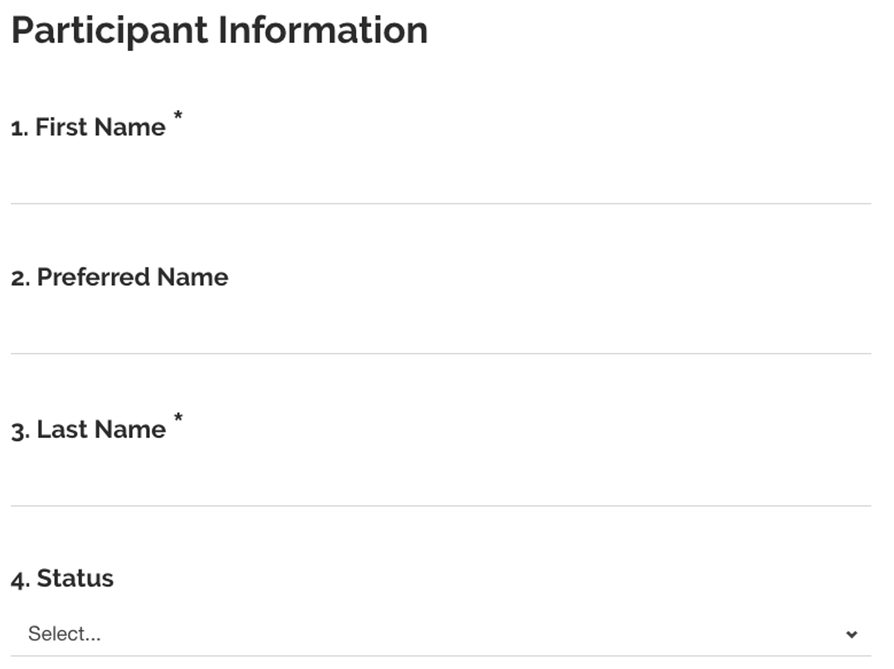
```
    e. Then you will be asked what other information you have for this participant. Select all that apply. 
```{r, echo=FALSE, fig.cap="", out.width = '100%', out.extra='style="background-color: #41444B; padding:2px;"', fig.align = 'center'}
knitr::include_graphics("ripple_other_info.png")
```
    f. For each selected, questions will appear to collect the information for the participant. Be sure to enter as much information for the participant as possible. 
    g. The last question is whether we can add them to our mailing list. 
    h. For the URG Outreach study, there are two more questions (see below) to indicate which studies this participant seems best suited for and what status the participant belongs in.
    <br/>
```{r, echo=FALSE, fig.cap="", out.width = '70%', out.extra='style="background-color: #41444B; padding:2px;"', fig.align = 'center'}
knitr::include_graphics("ripple_urg_referral.png")
```
        i. For the URG Status, all new participants should be “Contact Not Initiated”.
    i. Once this survey is complete, the information saved in the survey can be viewed in the participant contact card see below for more information. 
    
## Participant Contact Card
3. It is imperative that the participant's contact information be maintained in an accurate manner to ensure records are up to date.
4. To access a participant’s contact card, click the blue arrow next to their entry (in either potential participants or enrolled participants in any study or in the registry). Ideally, the contact card should be as complete as possible. It should be updated as soon as possible when any changes are available.
5. There are 9 sections to the contact card:

### General
```{r, echo=FALSE, fig.cap="", out.width = '80%', out.extra='style="background-color: #41444B; padding:2px;"', fig.align = 'center'}
knitr::include_graphics("ripple_general_contact.png")
```

1. This section has the participant’s first and last name at the top. You can change the first and last name by clicking on the name. 2. Custom ID and family ID
    a. The custom ID is used at the specific study ID, and the family ID is used to connect family members that each have their own ripple records. Some studies use the custom ID field, but the family ID field is not yet used. 
3. Global ID
    a. The global ID is assigned to all individuals at the time that they are added to Ripple. It is a 15-17 digit alpha-numeric unique identifier. The global ID is used across all Mesulam Center studies and follows participants from Ripple to other databases like, REDCap to link participants in each. 
4. Contact For Future Studies?
    a. Consent forms should include an optional element allowing researchers to contact for future studies. This box should only be checked if participants have consented or otherwise indicated that they would like to be contacted for future research studies.
5. Signed Consent Form
    a. Once an individual signs a consent form as a participant, this box should be checked, and the date of consent should be added for each study.
    
### Comments/Email/Contact/Consent/Forms
1. Comments
    a. Comments are used as general notes about a participant. 
    b. Only pertinent information should be added as comments.
    c. Comments should not be used to log contact attempts (see below). If a comment needs to be logged as a result of a contact attempt, log the contact attempt, then log the comment. 
    d. All comments are automatically logged as global, meaning they are visible to all studies. Most comments should be global. If a comment needs to be available to only the current study, unselect the “global” box. 
    e. Information that is reflected in custom variables should not be listed as comments or made global to avoid redundancy. See section below on custom variables.
2. Email
    a. All emails sent through Ripple will be seen here. See below for how to send emails or bulk emails through Ripple. 
    b. All emails should also be logged as a contact attempt, by checking the box for “log as contact attempt” when writing the email. 
3. Contact Attempts
    a. The contact tab is where all contact attempts made by any study team member to a research participant or study partner are logged. Any communication from a research participant to a study or study team member also needs to be logged.
    b. It is critical to capture how often we are reaching out to participants and how often they are responding or reaching out to us so that we can better plan for scheduling and better understand the science of recruitment. 
    c. All contact attempts should be documented within Ripple and marked as global.
    d. One contact attempt needs to be logged for any phone call, email or text message sent. And if sending an email or text, a separate contact attempt needs to be logged for each. Again, it is important to capture not just how often we reach out, but also how often the participant responds. 
    e. Ongoing email or text message conversations about a singular topic need only be documented as two contacts, one contact logged documenting that we reached out and one contact logged that the participant responded. 
    f. All phone calls should be documented individually along with their outcomes.
```{r, echo=FALSE, fig.cap="", out.width = '100%', out.extra='style="background-color: #41444B; padding:2px;"', fig.align = 'center'}
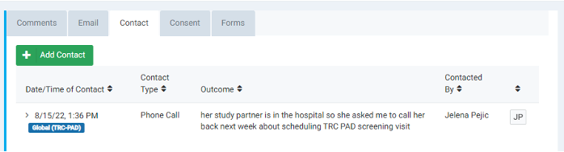
```
    g. Below is an example contact attempt log: 
```{r, echo=FALSE, fig.cap="", out.width = '70%', out.extra='style="background-color: #41444B; padding:2px;"', fig.align = 'center'}
knitr::include_graphics("ripple_contact_attempt.png")
```
    h. Be sure to fill out all applicable fields
    i. Regarding: Only Enter the Below Categories to better track why we are contacting participants:
        i. Screening 
            * All contact before enrollment. 
        ii.	Scheduling
        iii. ADRC Informant Only Call
        iv.	Brain Donation
        v. Information sent during/after visit
        vi.	Check-in/Psychosocial Pathway
        vii. Adverse Events
        viii.	Study Retention Events 
        ix.	Media Opportunities
        x. Moving Enrollment Groups
            * Participant moving from one group to another (in person to victual participation)
        xi.	MRI- Imaging Core
            * This category is reserved for the imaging team reaching out to participant. All MRI scheduling contact by the study team is logged as “scheduling”.
    j. Outcome: Contact attempt outcomes should be documented in each contact attempt to accurately capture recruitment efforts. The following outcomes will be made standard in each Ripple study: Spoke to Participant, Spoke to Study Partner, Left Voicemail, Other. Requests for additions or changes to contact outcomes should be given to the Manager.
    k. Always write descriptive notes about each contact attempt. 
    l. Comments: Be sure to log through notes about each contact. 
4. Consent Log 
    a. The consent log is not used for any studies. In the general section, check that consent has been signed and log the date. 
5. Forms
    a. PDFs of all completed surveys and screeners can be downloaded from here. 

### Events
1. This is where different visits are listed for each study. Completed and upcoming visits can be viewed here. 

### Tasks
1. All tasks associated with this participant will be shown here. 

### Contact Information
1. The participant and each study partner should have contact information listed within the participant’s contact card.
2. When new information is obtained, the contact card should be updated as soon as possible. When updating the participant’s contact information archive the old information and add the new information so the old contact information is preserved. 

### Demographics
1. Lists the participant’s age, sex, race, ethnicity and birthday.
2. Demographics should not be edited after initial completion except to correct an error.

### Custom Variables
1. Below the demographics are Mesulam Center wide or Specific study defined custom variables, data that is important to recruitment that is not captured in Ripple’s standard fields and features above. 
2. [Here](https://nuwildcat.sharepoint.com/:x:/s/FSM-MesulamCenterDataMgmt/EWmgquH9jwRAoISkUpz0occBBjIdNpnGjDWUw1J8TLMNsA?e=jmQDO2) is a link to all of the custom variables that are used in the Mesulam Center Ripple accompanied by a description of each variable and which study’s ripple page each variable is available in. 
3. All information completed on Ripple surveys will automatically fill in these fields if the survey id set up properly. 

### Recruitment
1. Ripple provides 3 recruitment variables that are specific to specific to each study and cannot be universal to all studies. Because the Mesulam center needs to track how participants are recruited outside of each study, these fields cannot be used. 

### Family
1. All family members that the participant is connected to through the family ID are listed here. 

## First Pass Consideration
1. Each week, a new participants added to Ripple email is sent out. For each participant on this list, update the First Pass Consideration Result and (if any) Reasons not pursuing for each study. One member from each study should complete the First Pass Consideration.
2. Navigate to the Registry. 
```{r, echo=FALSE, fig.cap="", out.width = '100%', out.extra='style="background-color: #41444B; padding:2px;"', fig.align = 'center'}
knitr::include_graphics("ripple_registry.png")
```
3. On the Registry page, search for each participant using the Ripple Global ID. 
```{r, echo=FALSE, fig.cap="", out.width = '50%', out.extra='style="background-color: #41444B; padding:2px;"', fig.align = 'center'}
knitr::include_graphics("ripple_search.png")
```
4. Select the participant and review their record. 
5. If they meet any First Pass criteria, find your study-specific First Pass variables under the ‘Custom Variables’ section. 
6. Select the appropriate ‘First Pass Consideration Result’. 
7. If the First Pass Result is ‘Not Pursuing’, find the variable ‘Reasons not pursuing’ and select the correct option from the dropdown list.
8. If the First Pass Result is ‘Potential participant’, immediately add the participant to the appropriate study. 
    a. View the ‘Adding Participants’ section in this SOP for more information. 

## First Contact Procedure
1. Upon first contacting a participant for screening, go to the potential participant tab for the list of potentially eligible participants. As mentioned in the potential participant section of this SOP, the participants in this tab will be separated into different screening statuses that are different for each study. 
```{r, echo=FALSE, fig.cap="", out.width = '100%', out.extra='style="background-color: #41444B; padding:2px;"', fig.align = 'center'}
knitr::include_graphics("ripple_pot_part_tab.png")
```
2. Find a participant that needs to be contacted and click the blue arrow to the right of their name in the potential participants list. 
```{r, echo=FALSE, fig.cap="", out.width = '100%', out.extra='style="background-color: #41444B; padding:2px;"', fig.align = 'center'}
knitr::include_graphics("ripple_select_participant.png")
```
3. At the top of the participant’s contact card, select “Survey Participant”.
```{r, echo=FALSE, fig.cap="", out.width = '50%', out.extra='style="background-color: #41444B; padding:2px;"', fig.align = 'center'}
knitr::include_graphics("ripple_survey_participant_button.png")
```
4. Click into the “Add/View Participant Survey”.
```{r, echo=FALSE, fig.cap="", out.width = '50%', out.extra='style="background-color: #41444B; padding:2px;"', fig.align = 'center'}
knitr::include_graphics("ripple_addview_participant.png")
```
5. This form gives an overview of the information we have on this participant. Right after the name and status is a question asking to confirm the recruitment information. All participants should be asked to confirm how they heard about us upon the first contact. 
<br/>
```{r, echo=FALSE, fig.cap="", out.width = '70%', out.extra='style="background-color: #41444B; padding:2px;"', fig.align = 'center'}
knitr::include_graphics("ripple_rec_source_confirm.png")
```
6. Check the current recruitment method that we have on file but scrolling down in the form. Confirm that the recruitment method that we have on file is the correct recruitment methods. 
<br/>
```{r, echo=FALSE, fig.cap="", out.width = '70%', out.extra='style="background-color: #41444B; padding:2px;"', fig.align = 'center'}
knitr::include_graphics("ripple_recruitment_source.png")
```
<br/>
7. Mark whether the recruitment method has been confirmed and add notes about the confirmation including your NetID and the date of the confirmation.
```{r, echo=FALSE, fig.cap="", out.width = '70%', out.extra='style="background-color: #41444B; padding:2px;"', fig.align = 'center'}
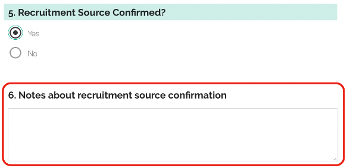
```
8. Review the rest of the form and obtain any information on the form that may still be blank. 
9. Log the contact in the Contact Log. 
10. Move them into another status if appropriate. Refer to study specific recruitment SOPs. 

## Emails/Bulk Emails
1. Navigate to the Potential Participants or Enrolled Participants tab.
2. Select the Participants you would like to receive the email communication.
    a. <b><i>Note: ‘Send Bulk Email’ option will not appear if only 1 participant is selected.</b><i/>
3. Select “Send Bulk Email” from the drop-down menu. Click apply to open the Select Bulk Email Template window. 
```{r, echo=FALSE, fig.cap="", out.width = '100%', out.extra='style="background-color: #41444B; padding:2px;"', fig.align = 'center'}
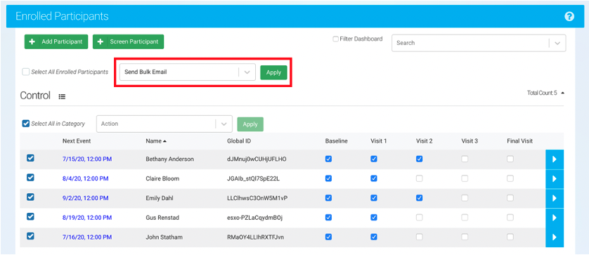
```
4. Select your desired email template from the dropdown list. 
```{r, echo=FALSE, fig.cap="", out.width = '70%', out.extra='style="background-color: #41444B; padding:2px;"', fig.align = 'center'}
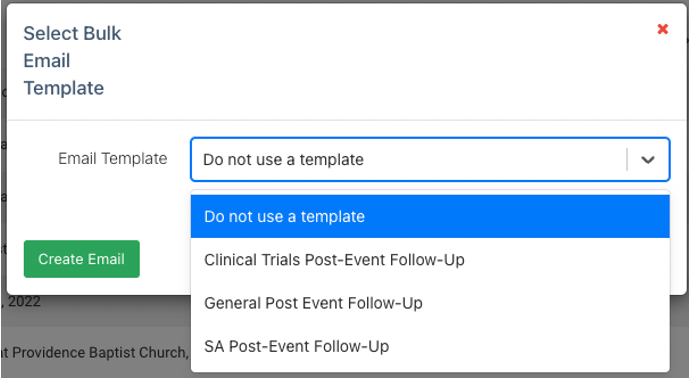
```
5. Review the email and <b><i>update the event name and event date</b><i/> fields.
6. <b>Select Contact and Global to mark update in the contact log.</b> 
```{r, echo=FALSE, fig.cap="", out.width = '100%', out.extra='style="background-color: #41444B; padding:2px;"', fig.align = 'center'}
knitr::include_graphics("ripple_bulk_email.png")
```
7. Click the “Send Emails” button to send the email to the selected participants. 

## Looking Up a Participant Through URG Outreach
1. Go to the “URG Outreach” study and the “Potential Participants” tab
2. The participants in the potential participant’s tab are sorted into two statuses, “Contact not initiated”, 
3. “Contact in progress, not enough information to add to a study”, and “Contact Initiated”
    a. All participants start as “Contact not Initiated” meaning no one has looked at the participant to determine if they should be contacted for participation. 
4. To search for participants that have not been contacted or added to a study:
    a. Review the participants in the “Contact not initiated” status. 
5. To search for all participants that the community engagement team thinks are appropriate for your study, click “filter dashboard” and type in the name of your study.
```{r, echo=FALSE, fig.cap="", out.width = '100%', out.extra='style="background-color: #41444B; padding:2px;"', fig.align = 'center'}
knitr::include_graphics("ripple_urg_filter.png")
```
6. For each participant that is potentially eligible, go into their contact card
    a. Go to the notes section to see any notes from the community engagement team
    b. Click “Survey This Participant” at the top of the card to see the demographic information gathered at the event. 
7. For participants that may be eligible and can be added to a study:
    a. Change their status from “Contact Not Initiated” to “Contact Initiated”
        i. Click the check box to the left of the participant Name
        ii. At the top of the category, in the “Action” drop down box, select “Potential Initiating Contact” to indicate that someone is taking ownership of contacting that participant and that person is responsible for adding the participant to the appropriate study. 
```{r, echo=FALSE, fig.cap="", out.width = '100%', out.extra='style="background-color: #41444B; padding:2px;"', fig.align = 'center'}
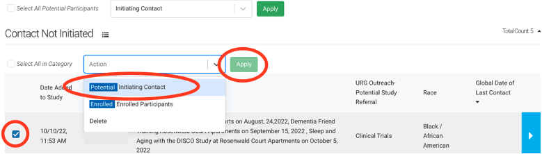
```
    b. Add participant to your study to continue recruitment. 
        i. Go back to the registry, search the participant’s name and check the box next to their name to add them to the study. 
```{r, echo=FALSE, fig.cap="", out.width = '100%', out.extra='style="background-color: #41444B; padding:2px;"', fig.align = 'center'}
knitr::include_graphics("ripple_add_participant.png")
```
8. For participants that may be eligible and can’t yet be added to a study:
    a. Change their status from “Contact Not Initiated” to “Contact in progress, not enough information to add to a study”
        i. Click the check box to the left of the participant Name
        ii. At the top of the category, in the “Action” drop down box, select “Potential-Contact in progress, not enough information to add to a study” to indicate that someone is taking ownership of contacting that participant and that person is responsible for adding the participant to the appropriate study. 
```{r, echo=FALSE, fig.cap="", out.width = '100%', out.extra='style="background-color: #41444B; padding:2px;"', fig.align = 'center'}
knitr::include_graphics("ripple_urg_filter.png")
```
    b. Once there is sufficient information to add them to a study:
        i. Change their status from “Contact Not Initiated” to “Contact in progress, not enough information to add to a study”
            1. Click the check box to the left of the participant Name
            2. At the top of the category, in the “Action” drop down box, select “Potential-Contact Initiating” 
    c. Add participant to your study to continue recruitment. 
        i. Go back to the registry, search the participant’s name and check the box next to their name to add them to the study. 
```{r, echo=FALSE, fig.cap="", out.width = '100%', out.extra='style="background-color: #41444B; padding:2px;"', fig.align = 'center'}
knitr::include_graphics("ripple_add_participant.png")
```


<!--chapter:end:01-ripple-sop.Rmd-->

# Excel Features SOP 

This document functions as an instruction manual for Excel features commonly 
used after a REDCap Report is downloaded. All examples were created using the az_demo and az_test datasets, which contain computer-generated sample data via the <i>randomNames</i> R package.  

<b>Note:</b> <i>An important step to conserve the order of the original data is to add an 
index column. Left click the first column. Select ‘Insert’ from the dropdown. 
Title the new column ‘Index’. Enter a 1 in the first row with data, a 2 to the 
second row, and a 3 to the third row. Select the cells with the 1, 2, and 3 
indexes. Double-click on the small box on the lower right-hand side of the 
selected cells, which will auto-populate index values for all rows that contain 
data.</i>


## Find
1. Highlight the data you wish to search. Use the shortcut ‘Ctrl + F’ on a 
Windows or ‘Cmd + F’ on a Mac OR select the magnifying glass icon 
```{r, echo=FALSE, fig.cap="", out.width = '7%', out.extra='style="background-color: #41444B; padding:2px;"', fig.align = 'center'}
knitr::include_graphics("search_icon_excel.png")
```
in the navigation pane. 
2. Enter the search keywords into the search bar and press enter to view. 
3. Continuing to press enter will cycle through all locations of the search keyword in the spreadsheet.
    Ex:
```{r, echo=FALSE, fig.cap="", out.width = '40%', out.extra='style="background-color: #41444B; padding:2px;"', fig.align = 'center'}
knitr::include_graphics("search_bar_excel.png")
```
4. For a more advanced search, use the ‘Advanced Search’ window. 
```{r, echo=FALSE, fig.cap="", out.width = '105%', out.extra='style="background-color: #41444B; padding:2px;"', fig.align = 'center'}
knitr::include_graphics("advanced_search_excel.png")
```


## Find & Replace
1. Highlight the data you wish to search and replace. This can include a single 
or multiple columns, or the entire spreadsheet. 
2. Use the shortcut ‘Ctrl + F’ on a 
Windows or ‘Cmd + F’ on a Mac OR select the magnifying glass icon 
```{r, echo=FALSE, fig.cap="", out.width = '7%', out.extra='style="background-color: #41444B; padding:2px;"', fig.align = 'center'}
knitr::include_graphics("search_icon_excel.png")
```
in the navigation pane and select 'Replace...' from the dropdown. 
```{r, echo=FALSE, fig.cap="", out.width = '15%', out.extra='style="background-color: #41444B; padding:2px;"', fig.show='hold', fig.align = 'center'}
knitr::include_graphics("replace_button_excel.png")
```

3. Enter the search keywords into the ‘Find what’ search bar. 
4. Enter the replacement into the ‘Replace with’ search bar. 
    Ex: Replace a diagnosis acronym with the full name.
```{r, echo=FALSE, fig.cap="", out.width = '90%', out.extra='style="background-color: #41444B; padding:2px;"', fig.show='hold', fig.align = 'center'}
knitr::include_graphics("find_and_replace_excel.png")
```
5. Click ‘Replace’ for a single cell replacement or ‘Replace All’ to replace all selected data. 


## Sort Data
1.	To Sort or Filter data, begin by selecting the columns or rows you wish to 
filter. To add filters to all columns, click the downward triangle icon 
```{r, echo=FALSE, fig.cap="", out.width = '5%', out.extra='style="background-color: #FFFFFF; padding:2px;"', fig.align = 'center'}

```
in the upper lefthand corner of the spreadsheet. This selects all data in the spreadsheet. 
2. Navigate to the Editing dropdown on the Home tab in Excel. 
```{r, echo=FALSE, fig.cap="", out.width = '100%', out.extra='style="background-color: #41444B; padding:2px;"', fig.show='hold', fig.align = 'center'}
knitr::include_graphics("sort_options_excel.png")
```
3.	Click ‘Sort & Filter’ for a dropdown and select one of the three sort options:
    a. ‘Sort A to Z’ sorts alphabetically or numerically in ascending order. 
    b. ‘Sort Z to A’ sorts alphabetically or numerically in descending order. 
    c. ‘Custom Sort…’ opens a window for further sorting criteria.
```{r, echo=FALSE, fig.cap="", out.width = '100%', out.extra='style="background-color: #41444B; padding:2px;"', fig.show='hold', fig.align = 'center'}
knitr::include_graphics("custom_sort_excel.png")
```

Ex: Sort all data first by date of birth, then by race. Select the column ‘dob’ 
and order ‘Oldest to Newest’. Then select the ‘+’ to add another sort criteria. 
Select the column ‘race’ and order ‘A to Z’. 

```{r, echo=FALSE, fig.cap="", out.width = '70%', out.extra='style="background-color: #41444B; padding:2px;"', fig.show='hold', fig.align = 'center'}
knitr::include_graphics("sort_order_excel.png")
```

4. Enter all sorting criteria, then select ‘OK’. The selected data will now be sorted using your desired order. 
5. To revert to original order, sort by the index column in ascending order.


## Filter Data
<i>Filters can be used to obtain desired data or remove unwanted data. With the 
filter tool, the user can specify column criteria they would like to be met and 
view only those rows. To remove unwanted data from a spreadsheet, filter the data 
to obtain what is NOT wanted, 
then delete those rows. When the ‘Clear’ filter is applied, the undesired rows 
will be removed from the spreadsheet. A filter will not remove the rows from the 
spreadsheet until the user manually deletes the rows.</i>

1. To Sort or Filter data, begin by selecting the columns or rows you wish to 
filter. To add filters to all columns, click the downward triangle icon 
```{r, echo=FALSE, fig.cap="", out.width = '5%', out.extra='style="background-color: #FFFFFF; padding:2px;"', fig.align = 'center'}

```
in the upper lefthand corner of the spreadsheet. This selects all data in the 
spreadsheet. 
2. Navigate to the Editing dropdown on the Home tab in Excel. 
```{r, echo=FALSE, fig.cap="", out.width = '100%', out.extra='style="background-color: #41444B; padding:2px;"', fig.show='hold', fig.align = 'center'}
knitr::include_graphics("sort_and_filter_tab_excel.png")
```
3. Click ‘Sort & Filter’ for a dropdown and select ‘Filter’. The columns that 
were selected will now have a dropdown arrow. 

```{r, echo=FALSE, fig.cap="", out.width = '50%', out.extra='style="background-color: #41444B; padding:2px;"', fig.show='hold', fig.align = 'center'}
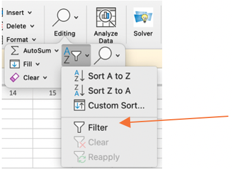
```

4. Select the arrow next to the column you would like to use as a filter. A box 
will pop up for the filter selection criteria.
```{r, echo=FALSE, fig.cap="", out.width = '100%', out.extra='style="background-color: #41444B; padding:2px;"', fig.show='hold', fig.align = 'center'}
knitr::include_graphics("filter_options_excel.png")
```

5. Select all necessary criteria and ‘Apply Filter’.
    a. <b>Note:</b> if a filter is being used to view and delete unwanted rows, after 
    applying the filter only the unwanted rows will be left. Select the rows to 
    be deleted and delete as normal. When the filter is cleared, only the desired 
    rows will be left in the spreadsheet. 
6. To clear a filter and view all rows of data, repeat steps 2 and 3 but select 
the ‘Clear’ option instead. All data that was not manually deleted will remain. 


## Fill Empty Data
<i>The Fill function allows the user to specify criteria to fill in any cells 
with missing data. This is a useful tool when certain information is only in one 
row of the data, but needs to be entered in all rows with the same Global ID, 
PTID, name, etc. </i>

1. Starting data will look something like below: data for certain columns will 
be missing for specific rows. For example, stub information might only appear 
for stub events and will not be in the visit rows of data. This information 
will be filled using the fill function. 
2. Select the column you need to fill. Press ‘Ctrl + G’ for the ‘Go To’ pop-up 
window in Excel. Select ‘Special…’. A new pop-up window will appear. Select 
‘Blanks’ and press OK. All empty cells will be highlighted.
```{r, echo=FALSE, fig.cap="", out.width = '100%', out.extra='style="background-color: #41444B; padding:2px;"', fig.show='hold', fig.align = 'center'}
knitr::include_graphics("select_empty_cells_excel.png")
```
3. In the formula bar, enter the formula that matches the necessary criteria to 
fill the cell. 
    a. In this example, the formula is saying “If the id in 
    <span style="color: #0070C0">cell 1-4 (1003)</span> is equal to the id in 
    <span style="color: #FF0000">cell 1-5 (1003)</span>, then the current cell 
    equals the sex in <span style="color: #7030A0">cell 2-4 (Male)</span>. Else,
    leave the current cell blank (the id in cell 1-4 does not equal the id in cell 1-5).”
4. Press ‘Ctrl + Enter’ to carry the formula into each empty cell. The Excel 
formula will automatically move to the next cells down.
```{r, echo=FALSE, fig.cap="", out.width = '100%', out.extra='style="background-color: #41444B; padding:2px;"', fig.show='hold', fig.align = 'center'}
knitr::include_graphics("fill_empty_cells_excel.png")
```
5. If more than one column needs to be matched before filling the empty cells, 
use an AND statement and separate matching criteria by a comma: 
    a. Ex: If both Global ID and PTID needed to be the same to fill in the name 
    of a participant, use the following statement in the formula bar 
    (highlighting the cells accordingly): 
    
    =IF(AND(<span style="color: #0070C0">global_id_cell_1</span>=
<span style="color: #FF0000">global_id_cell_2</span>,
<span style="color: #7030A0">ptid_cell_1</span>=
<span style="color: #00B050">ptid_cell_2</span>),
<span style="color: #ED7D31">sex_cell_1</span>,””)
    b. The above statement is saying in plain English: If the 
    <span style="color: #0070C0">global id of cell 1</span> equals the 
    <span style="color: #FF0000">global id of cell 2</span> and the 
    <span style="color: #7030A0">ptid of cell 1</span> equals the 
    <span style="color: #00B050">ptid of cell 2</span>, then the current cell equals the 
    <span style="color: #ED7D31">sex of cell 1</span>. Else, leave the current cell 
    blank (if global ids, or ptids, or both are not the same between the rows). 


## Delete Empty Rows
<i>The following steps can be used to delete any completely empty rows from a 
spreadsheet. This will keep any rows that contain some information. If you 
export data and for any reason it has missing rows (see below) this is a quick 
and easy trick to remove those.</i>
```{r, echo=FALSE, fig.cap="", out.width = '100%', out.extra='style="background-color: #41444B; padding:2px;"', fig.show='hold', fig.align = 'center'}
knitr::include_graphics("empty_rows_excel.png")
```

1. At the end of the data, add a new column labeled ‘Blanks’. 
2. In the first cell of the ‘Blanks’ column, enter the formula as shown below 
for any columns that should contain data. 
    a. Enter ‘=COUNTA()’ in the formula bar.
    b. Within the parenthesis, select all columns in the specific row that 
    should contain data. 
    c. Press ‘Enter’ to enter the formula. 
```{r, echo=FALSE, fig.cap="", out.width = '100%', out.extra='style="background-color: #41444B; padding:2px;"', fig.show='hold', fig.align = 'center'}
knitr::include_graphics("blanks_excel.png")
```
3. Double click or drag the green box in the lower right corner of the cell to 
fill down the formula. 
```{r, echo=FALSE, fig.cap="", out.width = '10%', out.extra='style="background-color: #41444B; padding:2px;"', fig.show='hold', fig.align = 'center'}
knitr::include_graphics("drag_corner_excel.png")
```
Any 0 values indicate that the row is empty. Any value 
greater than 0 indicates that at least one column has data. 

4. Filter and delete all blank rows. 
    a. Select the ‘Blanks’ column. Navigate to the filter window. Unselect all 
    except ‘0’ values.
```{r, echo=FALSE, fig.cap="", out.width = '100%', out.extra='style="background-color: #41444B; padding:2px;"', fig.show='hold', fig.align = 'center'}
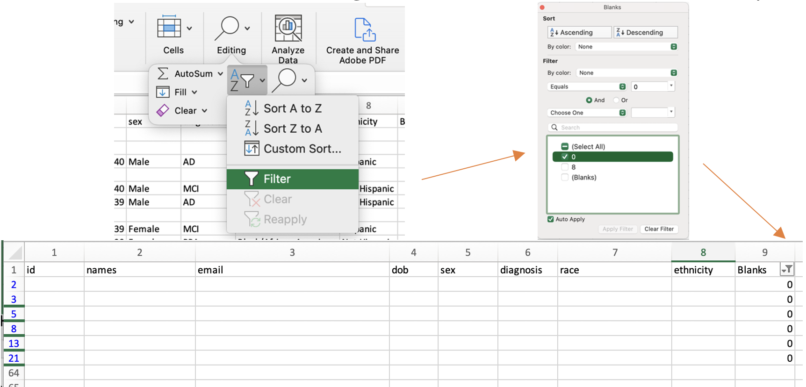
```
    b. Select all the rows with 0 values. Left click and select ‘Delete Row’. 
5. Clear the filter. All empty rows will now be gone from the spreadsheet. 


## VLOOKUP
<i>VLOOKUP uses a lookup value to find certain matches within the same spreadsheet 
or in another spreadsheet and return a user-specified value based on the match. 
The function takes the form:</i>

=VLOOKUP(lookup_value, table_array, col_index_num, [range_lookup])

1. Before you begin using the formula, determine what you are looking for and what 
you will want returned. There are four items you need to fill in for the formula to work:
    a. lookup_value:  the value you are searching for (a single cell)
    b. table_array: the range of the search (typically a column or multiple columns)
    c. col_index_num: the column of the desired return value within the table_array range
    d. range_lookup: TRUE if you want to locate an approximate match to your lookup_value; 
    FALSE if you want to locate an exact match to your lookup_value
2. Use the above formula within the first cell where you want the returned value to be entered. 
3. Drag the formula down to perform the VLOOKUP on all cells in a specific column. 

The following examples will use two separate spreadsheets: one contains a list 
of participant ids and demographic information (az_demo); the other contains a 
list of participant id’s and visit dates and test scores (az_test). 

```{r, echo=FALSE, fig.cap="", out.width = '100%', out.extra='style="background-color: #41444B; padding:2px;"', fig.show='hold', fig.align = 'center'}
knitr::include_graphics("az_demo_test_sheets.png")
```

<br/>

### <b>Example 1:</b> 
<b>Lookup participant id from az_test and add ‘sex’ from the az_demo spreadsheet to the az_test spreadsheet.<b/>  

1. Identify the cell where you want to perform VLOOKUP.
    a. I want to add ‘sex’ to column N in the az_test spreadsheet
    b. My first cell in column N with a participant id is N2
    c. Optional: add a column name
2. Enter the following to begin the formula in the cell: =VLOOKUP(
```{r, echo=FALSE, fig.cap="", out.width = '100%', out.extra='style="background-color: #41444B; padding:2px;"', fig.show='hold', fig.align = 'center'}
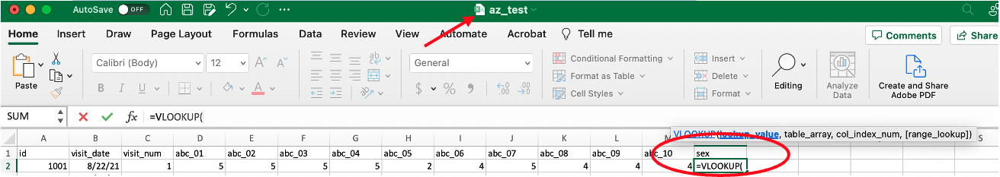
```
3. Select the lookup_value and add a comma.
    a. My first lookup_value is id 1001 from the az_test spreadsheet, so I select cell A2 and add a comma to tell the formula I am ready to proceed.
```{r, echo=FALSE, fig.cap="", out.width = '100%', out.extra='style="background-color: #41444B; padding:2px;"', fig.show='hold', fig.align = 'center'}
knitr::include_graphics("vlookup_1.2_excel.png")
```
4. Select the table_array (the range of columns where you want Excel to locate the lookup_value and the desired return value).
    a. My desired return value is ‘sex’ from the az_demo spreadsheet, which means I want Excel to search for my lookup_value in az_demo. 
        i. Note: moving to another spreadsheet, you will see that the VLOOKUP formula moves to the formula line of that spreadsheet for ease of use.
    b. My range of columns starts with A (id) and ends with E (sex) in the az_demo spreadsheet, so I select columns A-E.
```{r, echo=FALSE, fig.cap="", out.width = '100%', out.extra='style="background-color: #41444B; padding:2px;"', fig.show='hold', fig.align = 'center'}
knitr::include_graphics("vlookup_1.3_excel.png")
```
    c. Add a comma after the columns are selected to tell Excel you are ready to proceed.
5. Identify the column_index_num of your desired return value within the range of table_array columns. 
    a. table_array number always starts at 1, even if the first column of the range selected is not A.
    b. ‘sex’ is the 5th column, so my column_index_num is 5.
    c. Add a comma after the column_index_num to tell Excel you are ready to proceed.
```{r, echo=FALSE, fig.cap="", out.width = '100%', out.extra='style="background-color: #41444B; padding:2px;"', fig.show='hold', fig.align = 'center'}
knitr::include_graphics("vlookup_1.4_excel.png")
```
6. Enter TRUE or FALSE for your [range_lookup]. FALSE will only look for exact matches. 
    a. Typically, you will always want an exact match, so your [range_lookup] will be FALSE.
    b. In this case, I want an exact match to id 1001 from my az_test spreadsheet to my az_demo spreadsheet, so I enter FALSE.
    c. Add a close parenthesis to finish the formula.
```{r, echo=FALSE, fig.cap="", out.width = '100%', out.extra='style="background-color: #41444B; padding:2px;"', fig.show='hold', fig.align = 'center'}
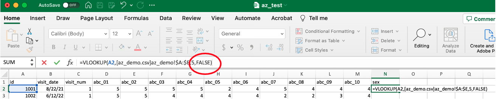
```
7. Press ‘Enter’ and the formula will complete the VLOOKUP.
    a. I now have the desired return value of sex for id 1001.
```{r, echo=FALSE, fig.cap="", out.width = '100%', out.extra='style="background-color: #41444B; padding:2px;"', fig.show='hold', fig.align = 'center'}
knitr::include_graphics("vlookup_1.6_excel.png")
```
8. To complete the VLOOKUP for the entire column of id values, drag the green corner to the end of the spreadsheet or double click the small green box when cell N2 is selected, which will automatically drag the formula down.
```{r, echo=FALSE, fig.cap="", out.width = '100%', out.extra='style="background-color: #41444B; padding:2px;"', fig.show='hold', fig.align = 'center'}
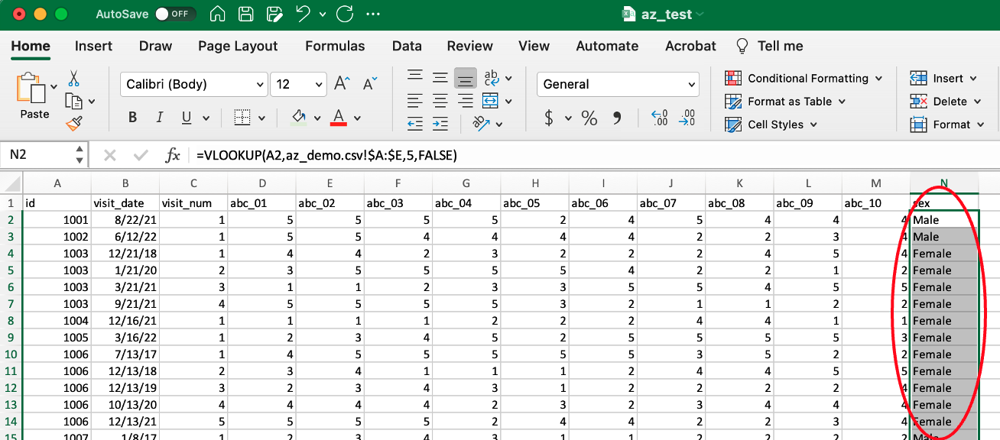
```

<br/>

### <b>Example 2:</b> 
<b>Lookup participant id from az_demo and determine the earliest visit date for each participant from az_test data. <b/>

1. Identify the cell where you want to perform VLOOKUP.
    a. I want to add ‘first_visit_date’ to column I in the az_demo spreadsheet
    b. My first cell in column I with a participant id is I2
    c. Optional: add a column name
2. Enter the following to begin the formula in the cell: =VLOOKUP(
```{r, echo=FALSE, fig.cap="", out.width = '100%', out.extra='style="background-color: #41444B; padding:2px;"', fig.show='hold', fig.align = 'center'}
knitr::include_graphics("vlookup_2.1_excel.png")
```
3. Select the lookup_value and add a comma.
    a. My first lookup_value is id 1001 from the az_demo spreadsheet, so I select cell A2 and add a comma to tell the formula I am ready to proceed.
```{r, echo=FALSE, fig.cap="", out.width = '100%', out.extra='style="background-color: #41444B; padding:2px;"', fig.show='hold', fig.align = 'center'}
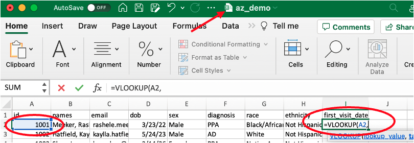
```
4. Select the table_array (the range of columns where you want Excel to locate the lookup_value and the desired return value).
    a. My desired return value is ‘visit_date’ from the az_test spreadsheet, which means I want Excel to search for my lookup_value in az_test 
        i. Note: moving to another spreadsheet, you will see that the VLOOKUP formula moves to the formula line of that spreadsheet for ease of use.
    b. My range of columns starts with A (id) and ends with B (visit_date) in the az_test spreadsheet, so I select columns A-B.
```{r, echo=FALSE, fig.cap="", out.width = '100%', out.extra='style="background-color: #41444B; padding:2px;"', fig.show='hold', fig.align = 'center'}
knitr::include_graphics("vlookup_2.3_excel.png")
```
    c. Add a comma after the columns are selected to tell Excel you are ready to proceed.
5. Identify the column_index_num of your desired return value within the range of table_array columns. 
    a. table_array number always starts at 1, even if the first column of the range selected is not A.
    b. Since I want the first visit date, I preface my column_index_num value with the MIN() function. 
        i. Note: Other functions can be used to specify which value to return for each id’s visit dates. MAX() will return the latest visit date. AVG() can be used to average test scores for a participant, etc.
    c. ‘visit_date’ is the 2nd column, so my column_index_num is 2. 
    d. Add a comma after the column_index_num to tell Excel you are ready to proceed.
```{r, echo=FALSE, fig.cap="", out.width = '100%', out.extra='style="background-color: #41444B; padding:2px;"', fig.show='hold', fig.align = 'center'}
knitr::include_graphics("vlookup_2.4_excel.png")
```
6. Enter TRUE or FALSE for your [range_lookup]. FALSE will only look for exact matches. 
    a. Typically, you will always want an exact match, so your [range_lookup] will be FALSE.
    b. In this case, I want an exact match to id 1001 from my az_test spreadsheet to my az_demo spreadsheet, so I enter FALSE.
    c. Add a close parenthesis to finish the formula. 
```{r, echo=FALSE, fig.cap="", out.width = '100%', out.extra='style="background-color: #41444B; padding:2px;"', fig.show='hold', fig.align = 'center'}
knitr::include_graphics("vlookup_2.5_excel.png")
```
7. Press ‘Enter’ and the formula will complete the VLOOKUP.
    a. I now have the desired return value of first_visit_date for id 1001.
```{r, echo=FALSE, fig.cap="", out.width = '100%', out.extra='style="background-color: #41444B; padding:2px;"', fig.show='hold', fig.align = 'center'}
knitr::include_graphics("vlookup_2.6_excel.png")
```
8. To complete the VLOOKUP for the entire column of id values, drag the green corner to the end of the spreadsheet or double click the small green box when cell N2 is selected.
```{r, echo=FALSE, fig.cap="", out.width = '100%', out.extra='style="background-color: #41444B; padding:2px;"', fig.show='hold', fig.align = 'center'}
knitr::include_graphics("vlookup_2.7_excel.png")
```

References: https://support.microsoft.com/en-us/office/vlookup-function-0bbc8083-26fe-4963-8ab8-93a18ad188a1


<!--chapter:end:02-excel-features-sop.Rmd-->

# Data Request SOP 

## Creating a New Data Request 

1. Navigate to the ‘Mesulam Center Data Requests’ database in REDCap.
2. Under the ‘Data Collection’ tab on the left panel, select [‘Add/Edit Records’](https://redcap.nubic.northwestern.edu/redcap/redcap_v13.1.25/DataEntry/record_home.php?pid=7662).
3. Click the large green ‘+ Add new record’ button. This will create a new Record ID and allow you to select the ‘Data Request’ and ‘Status’ Instruments. 
```{r, echo=FALSE, fig.cap="", out.width = '50%', out.extra='style="background-color: #41444B; padding:2px;"', fig.align = 'center'}
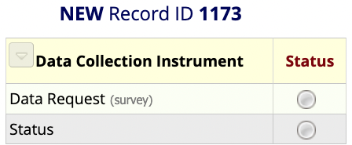
```

## Fill out the Data Request Form

1. Select the Data Request Instrument button under the Data Collection Instruments. 
2. Fill out the ‘Request Information’ and ‘Requestor Information’ Sections.
    a. Enter the Date of request, Requestor name, and Requestor email. 
    b. Enter the names of anyone else involved with or knowledgeable of the request.
    c. Select the type of Data Request.
        i. Collaborative Application – ALWAYS begins at Collaborative Applications and will   autofill. NEVER manually selected.
        ii.	Internal Data Request – most common and encompasses all data requests within the Mesulam Center that do not require a Collaborative Application
        iii.	Database Change/Creation – select when adding or changing fields within an existing database or creating a new database.
    d. Enter all studies and grant numbers that will be associated with this data request in the free text box.
    e. Indicate if there is potential for a publication. 
3. Fill out the ‘Request Data’ Section. 
    a. Write a brief description of the data request. This should be a few sentences about what is needed for the data request and, if known, why it is being requested.
    b. Enter a short description of the request. This should be a few words and is used to create the file name where all documents for this data request will be stored. Separate words with underscores (Test_Data_Request). 
```{r, echo=FALSE, fig.cap="", out.width = '100%', out.extra='style="background-color: #41444B; padding:2px;"', fig.align = 'center'}
knitr::include_graphics("file_name_test.png")
```
        i. For Data Management files, it is best to access them through your system’s local OneDrive. If you have not already done so, download the Data Management – Data Requests folder to your local drive by following instructions in the ['SharePoint SOP'](https://nuwildcat.sharepoint.com/:w:/r/sites/FSM-MesulamCenterDataMgmt/Shared Documents/Data Organization and Planning/SharePoint Procedures and Best Practices.docx?d=w819d1c213c3d4765971e49644a6914fa&csf=1&web=1&e=Itzs7L).
        ii. Create a new folder in the Data Requests Sharepoint. Copy and paste the calculated ‘File name’ to name the new folder. This is where all files for this data request will be stored. 
    c. Select the type(s) of data needed for the request.
        i. For each type of data requested, fill out the additional fields. 
    d. Select the UDS version(s) needed. 
        i. For current ADRC REDCap data, select UDS3. 
        ii. For historical ADRC data in StudyTracker, select MDS/UDS1/UDS2.
    e. Select the location(s) of the raw data for the request.
4. Fill out the ‘Request Tagging’ Section. 
    a. Select an ‘Impact/Need’ score on the slider scale. 
        i. Low Impact/Need – projects that are not of immediate concern and have low impact on future research and analyses; there may be no deadline for completion.
        ii. Medium Impact/Need – projects that need to be completed, but not as urgently as Maximum Impact/Need; may have a longer deadline before completion is due.  
        iii. Maximum Impact/Need – project completion is essential for future research/analyses; may have a strict deadline for completion. 
    b. Select if there is any concern about the completion of the project.
        i. If there is a real concern that the completion of the project may not be possible, it will be assigned a lower priority. Time spent should be prioritized to projects that can be completed. 
    c. Select the ‘Scope’ of the project. 
        i. Low Scope – little to no changes to procedures/methods/protocols; implementation can occur immediately or with little to no discussion. 
        ii. Medium Scope – slight changes to procedures/methods/protocols; discussion with other teams may be necessary before implementation can occur.
        iii. Maximum Scope – major changes to procedures/methods/protocols; may require training or coordination with other departments before implementation can occur. 
    d. Select the approximate total time ‘Duration’ in hours that will be spent working on this project. 
    e. The above fields will return a priority score, which can be used to prioritize all in-progress projects. 
    f. Select the reason(s) for the scope choice.
        i. Excel project
        ii. Single Database Project
        iii. Multiple Database Project
        iv. Simple Criteria
        v. Complex Criteria
        vi. Historic Data (pre-2015)
        vii. New Methodology Needed – (developing new system/analysis/protocol)
        viii. Collaboration Needed – multiple departments or collaborative application 
        ix. Documentation (SOP)
        x. Report/Visualization
        xi. Data Pull
        xii. Data Check
        xiii. Data Import
        xiv. Database Harmonization
        xv. Database Creation
        xvi. Database Modification
        xvii. Referral Pull - (pulling demographic information/names to send to collaborator to use the referrals as participants – REQUIRES COLLABORATIVE APPLICATION)
5. Fill out the ‘Storage Locations’ Section – this can be done immediately or when the data request is complete. 
    a. Paste the link to the Data Request folder. 
        i. In Sharepoint, left click on the folder of the data request. Select ‘Share’. A window will pop up with options to send the link to the folder.  
```{r, echo=FALSE, fig.cap="", out.width = '33%', out.extra='style="background-color: #41444B; padding:2px;"', fig.show='hold', fig.align = 'center'}
knitr::include_graphics(c("share_file.png","share_people_specify.png","share_existing_access.png"))
```
        ii. Select ‘People you specify can edit’ under the Copy link section. 
        iii. Select ‘People with existing access’. Click Apply. 
        iv.	Copy the link and paste into the corresponding box.  
    b. Paste the link to the Collaborators folder.
        i. Follow steps 5a-i. through 5a-iv for the Collaborator folder.
    c. Paste the link to the Collaborators data file.
        i. Follow steps 5a-i. through 5a-iv for the Collaborator file.
    d. Write up a brief description to document the data request OR Paste the link to the Documentation file in the Documentation box. 
        i. For additional information, see 2.6 Documenting the Data.
        ii. If Pasting a link, follow steps 5a-i. through 5a-iv.
6. Always mark the Form Status ‘Complete’. Save and Exit Form.


## Fill out the Status Instrument 

7. Select the Status Instrument button under the Data Collection Instruments. 
8. After creating a data request, select the appropriate status. 
9. Enter the Percent Complete.
    a. If not yet started, enter 0. 
    b. Update the Percent Complete as progress is made for the data request. 
10. The NetID will auto-populate for the person who is filling out the form. This can be changed manually as needed.
11. Enter the study/department(s) of the staff member who is completing the request.
11.	Enter any notes about the status of the data request.
12.	Always mark the Form Status ‘Complete’. Save and Exit Form.


## Completing the Data Request
1. After the Data Request Forms have been completed on REDCap, pull the required data. 
2. Save all files in the corresponding Data Request folder. 
3. If the Data Request is for a Collaborative Application, create the Collaborator folder within the Data Request folder. Store all files that will be shared with the Collaborator within the Collaborator folder. They will only have access to this specific folder, not the entire Data Request folder. 
4. Create a Data Dictionary – this should be stored in the Collaborator folder if there is one; otherwise, it can be stored in the general folder for this Data Request. See Step 3 for steps to create a data dictionary. 


## Creating the Data Dictionary
Note: The Data Dictionary will store all variables for the specific Data Request with information about each. This step should be completed for both internal data requests and collaborative application data requests to inform the receiver of the data on each of the variables. 

1. For each database used for the Data Request, navigate to the corresponding ‘Dictionary’ page which can be found on the left panel of REDCap.
```{r, echo=FALSE, fig.cap="", out.width = '60%', out.extra='style="background-color: #41444B; padding:2px;"', fig.align = 'center'}
knitr::include_graphics("data_dict_button.png")
```
2. Once on the Data Dictionary page, select ‘Download the current Data Dictionary’. A .csv file of all variables in the database will be downloaded. Open the downloaded file.  
3. Filter the Data Dictionary and delete any unneeded variables for the data request. 
4. Save the Data Dictionary in the Data Request folder, which should now consist of only the variables from a single database that were required for the Data Request. 
5. Compile all necessary variables from the database into a single .csv or .xlsx file by following the ['Data Dictionary Template'](https://nuwildcat.sharepoint.com/:x:/r/sites/FSM-MesulamCenterDataMgmt/Shared%20Documents/Data%20Requests/2023-04-14_REDCap_Reports_SOP/Data_Dictionary_Template.xlsx?d=w1c9abe17e62340c19618191f3e9ff3dd&csf=1&web=1&e=EDyHIh).
    a. The headings should ALWAYS appear in this order with the Column Headers on line 13 and the first variable on line 14. 
```{r, echo=FALSE, fig.cap="", out.width = '100%', out.extra='style="background-color: #41444B; padding:2px;"', fig.align = 'center'}
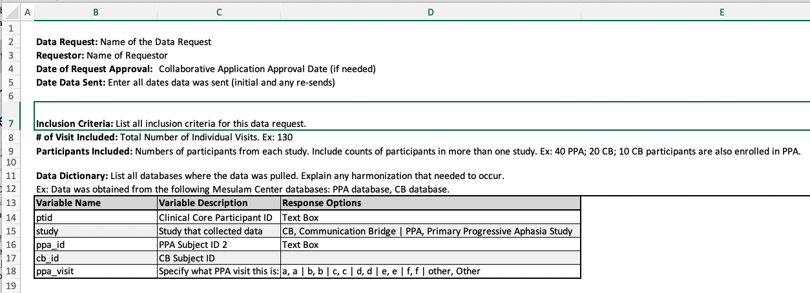
```
6. If more than one database was used for the Data Request, repeat steps 1 – 4 for each database, adding each set of new variables to the same Data Dictionary. 
    a. When using multiple databases for a data request, create new ‘Variable Name’ columns, specifying which database the variable came from if they are not stored in all databases used. 
7. Save the Data Dictionary file with the following format: <i>Date_Data_Request_Name</i>_Metadata. Ex: 2023_05_23_Data_Request_SOP_Metadata.


## Documenting the Data Request
The purpose of the data documentation for a Data Request is to explain everything that was done. This should include:

* How the data was pulled – which databases were used; specify if the data was pulled via a REDCap report, through the API, or through some other method.
* What data was pulled – which variables were pulled from each database.
* What was done to the data after it was pulled – additional filtering or sorting, adding comments/variables, calculations, etc.

<b>A.</b> If the documentation only consists of a few sentences or a few short paragraphs, it can be entered directly into the Data Request Form Documentation textbox.

<b>B.</b> If the documentation requires a longer explanation, create a word document and paste the link to the documentation into the Data Request Form Documentation textbox. 


## Sending Data Out

1. Create a new folder within the specific Data Request folder in SharePoint with the following format: <i>Date_MesCtr_Data_Request_Name_</i>Dataset. Ex: 2023_05_23_Data_Request_SOP_Dataset.
2. Move the finalized data dictionary to this folder.  
3. Add the data to this folder with the following format: <i>Date_Data_Request_Name_</i>Data. Ex: 2023_05_23_Data_Request_SOP_Data.
    a. Note: the data should be stored within a .csv or .xlsx file, or both. 
4. Within this folder, add another folder for all Documentation. Title this folder ‘Documentation’. 
    a. This is where the Documentation, scoring guidelines, and any other manuals for the data request will be stored. 


<!--chapter:end:03-data-request-sop.Rmd-->

# REDCap Reports SOP 

This document functions as an instruction manual for creating a REDCap Report within the Data Request Database. Creating a report allows the user to easily view their or their teams in progress and completed Data Requests. The user can also create their own customized reports as needed. 

For a more thorough guide for creating REDCap Reports in other study databases, view the following guide created by the University of Pennsylvania: <b>[REDCap Creating Reports_UPenn](https://nuwildcat.sharepoint.com/:b:/s/FSM-MesulamCenterDataMgmt/ESkD9lTkWAVOtZ5YtrgY-mEB0uT1oCJda0jJPQc-UTVPCA?e=Tn96sV)</b>

## Create a Mesulam Center Data Requests REDCap Report
1. Navigate to the Data Request REDCap database. 
2. Under Applications, click ‘Data Exports, Reports, and Stats’.
```{r, echo=FALSE, fig.cap="", out.width = '100%', out.extra='style="background-color: #41444B; padding:2px;"', fig.align = 'center'}
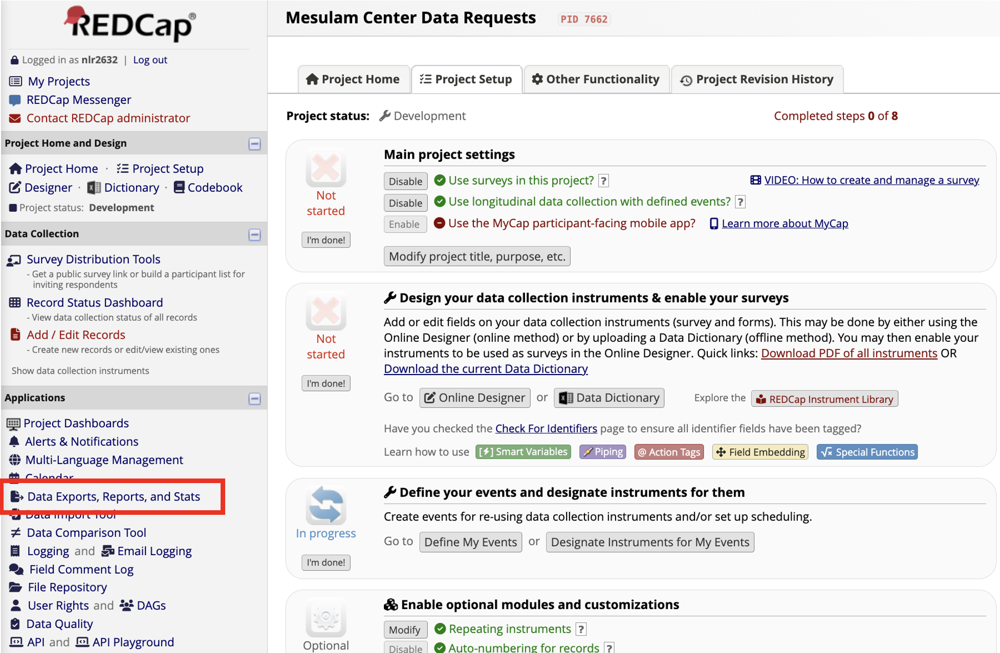
```
3. On the next page, click on the ‘+ Create New Report’ tab.
```{r, echo=FALSE, fig.cap="", out.width = '100%', out.extra='style="background-color: #41444B; padding:2px;"', fig.align = 'center'}
knitr::include_graphics("redcap_reports_1.2.png")
```
4. Enter information about the New Report.
    a. Enter a Name of Report. 
        i. Ex: All PPA Data Requests, Neuropath In-Progress, Nina-Completed
    b. Optional: Enter a brief Description of the Report.
```{r, echo=FALSE, fig.cap="", out.width = '100%', out.extra='style="background-color: #41444B; padding:2px;"', fig.align = 'center'}
knitr::include_graphics("redcap_reports_1.3.png")
```
5. Select User Access.
    a. Select if All users or Custom users can view the report.
    b. Select if All users or Custom users can edit the report.
```{r, echo=FALSE, fig.cap="", out.width = '100%', out.extra='style="background-color: #41444B; padding:2px;"', fig.align = 'center'}
knitr::include_graphics("redcap_reports_1.4.png")
```
6. Select all fields you would like to include in the report. 
    a. Below is an example of common fields to include in reports that will provide adequate information about the data request and the progress made for each request. 
```{r, echo=FALSE, fig.cap="", out.width = '100%', out.extra='style="background-color: #41444B; padding:2px;"', fig.align = 'center'}
knitr::include_graphics("redcap_reports_1.5.png")
```
7. Select additional options for your report.
```{r, echo=FALSE, fig.cap="", out.width = '100%', out.extra='style="background-color: #41444B; padding:2px;"', fig.align = 'center'}
knitr::include_graphics("redcap_reports_1.6.png")
```
8. Add filters to filter the report to specific staff or studies/departments that last worked on the data request. 
    a. Add the filter for the variable ‘study_last’ and select which study to filter.
    b. To view a particular staff members’ open requests, add the filter for the variable ‘staff_last’ and select which staff member(s) to filter. 
```{r, echo=FALSE, fig.cap="", out.width = '100%', out.extra='style="background-color: #41444B; padding:2px;"', fig.align = 'center'}
knitr::include_graphics("redcap_reports_1.7.png")
```
9. Optional: Live Filters
    a. Live filters can be used after the report has been generated. 
    b. Ex: Adding the variable ‘data_request_complete allows the user to filter by complete statuses after the report has been generated. 
```{r, echo=FALSE, fig.cap="", out.width = '100%', out.extra='style="background-color: #41444B; padding:2px;"', fig.align = 'center'}
knitr::include_graphics("redcap_reports_1.8.png")
```
10. Optional: Determine your preferred ordering of the results. 
    a. Ex: Sort the results first by priority (‘priority_score’) then status (‘rqst_ovstatus’).
```{r, echo=FALSE, fig.cap="", out.width = '100%', out.extra='style="background-color: #41444B; padding:2px;"', fig.align = 'center'}
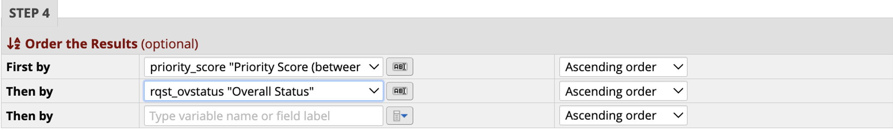
```
11. Click the Save Report button. A new screen will open up. Click View report to view. 
```{r, echo=FALSE, fig.cap="", out.width = '100%', out.extra='style="background-color: #41444B; padding:2px;"', fig.align = 'center'}
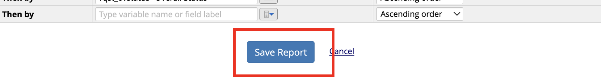
```
```{r, echo=FALSE, fig.cap="", out.width = '100%', out.extra='style="background-color: #41444B; padding:2px;"', fig.align = 'center'}
knitr::include_graphics("redcap_reports_1.11.png")
```
12. To view a report previously created, navigate to the ‘My Reports and Exports’ tab from the Reports Page. From here, you can view or export any reports. You can also navigate to the previously created reports from the sidebar. 
```{r, echo=FALSE, fig.cap="", out.width = '100%', out.extra='style="background-color: #41444B; padding:2px;"', fig.align = 'center'}
knitr::include_graphics("redcap_reports_1.12.png")
```


<!--chapter:end:04-redcap-reports-sop.Rmd-->

# SharePoint SOP 

SharePoint will be used to create, save, edit, and collaborate on files. 

## Access SharePoint Files Online
1. Go to your [SharePoint Homepage](https://nuwildcat.sharepoint.com/_layouts/15/sharepoint.aspx).
2. Select the desired SharePoint, which will contain all folders and files.
3. All word and excel files will open through office 365 in your browser.  
4. For collaboration, avoid downloading file and re-uploading to SharePoint. Instead edit the file in your browser or download SharePoint to your local drive (see the “Download SharePoint to your local drive” section below).   

## Collaborating within Word and Excel Documents
1. When adding comments, notes or questions in Word or Excel, type “@” and start typing the name of the person responsible for addressing the comment. A list of options will appear, click a name to send an alert of the comment. The person will receive an email with the question or comment included and can reply directly in the email or can go to the document to address the issue. 
```{r, echo=FALSE, fig.cap="", out.width = '70%', out.extra='style="background-color: #41444B; padding:2px;"', fig.align = 'center'}
knitr::include_graphics("sharepoint_1.1.png")
```

## Auto Saving Files in SharePoint 
1. When collaborating in SharePoint files, all edits are auto saved 
    a. Best practices should include saving “check point” files along the way when collaborating on a project that requires multiple rounds of review so that past versions of the document can be easily found if needed.  
    b. When collaborating on a file that is auto saved, turn on track changes so that everyone knows who made each change. 
    
## Download SharePoint to your Local Drive
1. To download a SharePoint folder to your local drive, you must already have OneDrive on your machine.  
    a. [Download OneDrive for Mac](https://services.northwestern.edu/TDClient/30/Portal/KB/ArticleDet?ID=1683) 
    b. [Download OneDrive for Windows](https://services.northwestern.edu/TDClient/30/Portal/KB/ArticleDet?ID=1682) 
2. Once you have access to OneDrive on your Machine, go to the SharePoint Documents Page. 
3. At the top of the page, click “Add shortcut to OneDrive”.
```{r, echo=FALSE, fig.cap="", out.width = '100%', out.extra='style="background-color: #41444B; padding:2px;"', fig.align = 'center'}
knitr::include_graphics("sharepoint_1.2.png")
```
4. Within a few minutes, a new folder should appear in your OneDrive for the SharePoint Documents folder you added. 
5. Once this “Documents” folder is added to your local drive, you can create files and edit files without interacting with the web interface. 
6. All files edited in Word and Excel will be auto saved to SharePoint.  

<b>IMPORTANT:</b> If you drag a file from your local SharePoint to your desktop, that file will be deleted for everyone on SharePoint and will only exist on your machine. SharePoint works best for collaboration when all files are edited within SharePoint and office 365, downloading a file should never be necessary. Similarly, if a file is deleted on a SharePoint local drive, it is deleted for everyone. Do not delete any files in which you are not the only author.  

## Share Files
1. SharePoint Files can be shared 1 of 3 ways: User access to the full site, access to a folder, or access to a single file.  
2. For granting access to one file or folder: 
    a. In the online SharePoint: Click the three vertical dots next to any file or folder, click “Share”. 
```{r, echo=FALSE, fig.cap="", out.width = '100%', out.extra='style="background-color: #41444B; padding:2px;"', fig.align = 'center'}
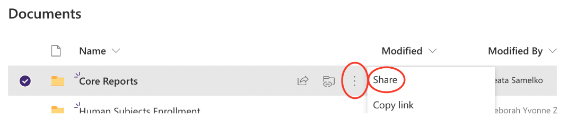
```
    b. In SharePoint on a local drive, right click on the file or folder and click “Share”.  
    c. In both cases, the same dialog box will appear.  
        i. Enter the email address in the “To:” field to share the file or folder. 
```{r, echo=FALSE, fig.cap="", out.width = '70%', out.extra='style="background-color: #41444B; padding:2px;"', fig.align = 'center'}
knitr::include_graphics("sharepoint_1.4.png")
```
        ii. An email will be sent to the entered email address with an invitation to the file or folder.  
        iii. The link to the file can also be copied and sent separately by clicking “Copy link” at the bottom of the dialog box.  

## Copy the Link to a File or Folder
1. In the online SharePoint: Click the three vertical dots next to any file or folder, click “Copy link”. 
2. In SharePoint on a local drive, right click on the file or folder, then click “Share”. The same “send link dialog box will appear.  
3. Copy the link by selecting “People with existing access” instead of “People you specify…”, then click “Apply”, and finally click “Copy link”.  
```{r, echo=FALSE, fig.cap="", out.width = '100%', out.extra='style="background-color: #41444B; padding:2px;"', fig.align = 'center'}
knitr::include_graphics("sharepoint_1.5.png")
```
```{r, echo=FALSE, fig.cap="", out.width = '60%', out.extra='style="background-color: #41444B; padding:2px;"', fig.align = 'center'}
knitr::include_graphics("sharepoint_1.6.png")
```


<!--chapter:end:05-sharepoint-sop.Rmd-->

# Github SOP 

## Creating a new page on the Mesulam Center Data Management Practices website. 
1. Create a new r Markdown file and save in the following format: 
    chapter number-title.Rmd (ex. 06-github-sop.Rmd)

2. Headings:
A single # is used to title the chapter page. (Github SOP at the top of the page)
## Double ## is used for a Heading and Section Title in the Table of Contents on 
the right hand side. 
### Triple ### is used for a Subheading and Sub-section Title in the Table of Contents 
on the right hand side. 
Note: Github and Bookdown automatically numbers the Table of contents based on the 
saved name of the R Markdown file. 

<!--chapter:end:06-github-sop.Rmd-->

